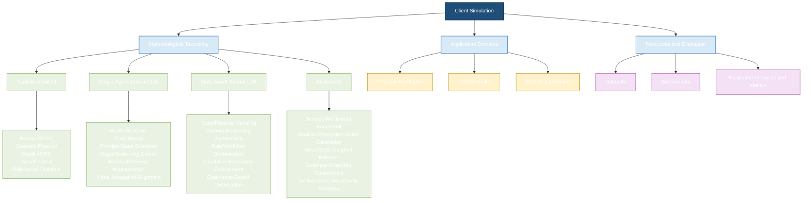

# A Survey of Client Simulation in Healthcare and Beyond

 

Curated resources for **A Survey of Client Simulation in Healthcare and Beyond**.

- Paper: coming soon

## Scope and verification

This index mirrors the active rows in the manuscript's five summary tables. Commented-out table rows and background-only citations are intentionally excluded. Years follow the manuscript tables (which use the publication year for venue papers and the table-assigned year for preprints); links point to DOI records, official proceedings, PubMed, publisher pages, or arXiv. A code link is included only when an author-associated repository could be verified from the paper, its official page, or the repository itself. `—` means that no verified public code repository was found.

Last table-to-paper and code-link audit: **2026-09-05**.

## Contents

- [Traditional-based client simulation](#1-traditional-based-client-simulation)
- [Single-agent textual LLM simulation](#2-single-agent-textual-llm-simulation)
- [Multi-agent textual LLM simulation](#3-multi-agent-textual-llm-simulation)
- [Multimodal client simulation](#4-multimodal-client-simulation)
- [Datasets, benchmarks, and evaluation protocols](#5-datasets-benchmarks-and-evaluation-protocols)

## 1. Traditional-based client simulation

| Method | Year | Venue / Source | Paper | Code |
|---|---:|---|---|---|
| Standardized Patient (SP) | 1968 | CMAJ | [Simulated patients in medical teaching](https://pubmed.ncbi.nlm.nih.gov/5646104/) | — |
| OSCE Assessment | 1975 | BMJ | [Assessment of clinical competence using objective structured examination.](https://www.bmj.com/content/1/5955/447) | — |
| OSCE Standard Framework | 1979 | Medical Education | [Assessment of clinical competence using an objective structured clinical examination (OSCE).](https://doi.org/10.1111/j.1365-2923.1979.tb00918.x) | — |
| Harvey Cardiology Simulator | 1980 | American Journal of Cardiology | [“Harvey,” the cardiology patient simulator: Pilot studies on teaching effectiveness](https://doi.org/10.1016/0002-9149%2880%2990123-x) | — |
| SP Educational Framework | 1993 | Academic Medicine | [An overview of the uses of standardized patients for teaching and evaluating clinical skills. AAMC](https://doi.org/10.1097/00001888-199306000-00002) | — |
| OR Crisis Simulation | 1995 | Journal of clinical anesthesia | [Anesthesia crisis resource management: Real-life simulation training in operating room crises](https://doi.org/10.1016/0952-8180%2895%2900146-8) | — |
| Trauma Team Simulation | 2002 | Journal of Trauma | [Evaluation of Trauma Team Performance Using an Advanced Human Patient Simulator for Resuscitation Training](https://doi.org/10.1097/00005373-200206000-00009) | — |
| Cardiac Arrest Team Simulation | 2008 | Chest | [Simulation-Based Education Improves Quality of Care During Cardiac Arrest Team Responses at an Academic Teaching Hospital: A Case-Control Study](https://doi.org/10.1016/s0734-3299%2808%2979117-2) | — |
| CVC Mastery Learning | 2009 | Critical care medicine | [Simulation-based mastery learning reduces complications during central venous catheter insertion in a medical intensive care unit*](https://doi.org/10.1097/ccm.0b013e3181a57bc1) | — |
| AMEE SP Guide | 2009 | Medical Teacher | [The use of simulated patients in medical education: AMEE Guide No 42](https://doi.org/10.1080/01421590903002821) | — |
| Procedural Skill Training | 2015 | BMC Medical Education | [The benefit of repetitive skills training and frequency of expert feedback in the early acquisition of procedural skills](https://doi.org/10.1186/s12909-015-0286-5) | — |
| Psychotherapy SP Training | 1998 | Academic Medicine | [Using standardized patients to teach and learn psychotherapy](https://doi.org/10.1097/00001888-199805000-00058) | — |
| Affective SP Portrayal | 1999 | Teaching and Learning in Medicine | [Effects of Portraying Psychologically and Emotionally Complex Standardized Patient Roles](https://doi.org/10.1207/s15328015tl110303) | — |
| Emotional Realism SP | 2001 | Academic medicine : journal of the Association of American Medical Colleges | [Conveying Emotional Realism](https://doi.org/10.1097/00001888-200103000-00003) | — |
| Psychotherapy Feedback SP | 2002 | Academic Psychiatry | [Using Standardized Patients for Formative Feedback in an Introduction to Psychotherapy Course](https://doi.org/10.1176/appi.ap.26.3.168) | — |
| Undergraduate Psychiatry SP | 2007 | Psychiatric Bulletin | [Simulated patients in undergraduate education in psychiatry](https://doi.org/10.1192/pb.bp.106.010793) | — |
| Virtual Patient Interview | 2008 | Studies in Health Technology and Informatics | [Objective structured clinical interview training using a virtual human patient](https://pubmed.ncbi.nlm.nih.gov/18391321/) | — |
| PTSD Virtual Patient | 2008 | LNCS | [Evaluation of Justina: A Virtual Patient with PTSD](https://doi.org/10.1007/978-3-540-85483-8_40) | — |
| SP Anxiety Reduction | 2014 | Clinical Simulation in Nursing | [Utilization of Standardized Patients to Decrease Nursing Student Anxiety](https://doi.org/10.1016/j.ecns.2014.09.006) | — |
| Psychiatric Simulation Engagement | 2017 | Academic Psychiatry | [Simulation in Undergraduate Psychiatry: Exploring the Depth of Learner Engagement](https://doi.org/10.1007/s40596-016-0633-9) | — |
| Psychiatry SP Evaluation | 2018 | BMC Medical Education | [Standardized patients in psychiatry – the best way to learn clinical skills?](https://link.springer.com/article/10.1186/s12909-018-1184-4) | — |
| Psychiatric Communication Training | 2020 | Frontiers in Psychiatry | [Single-Day Simulation-Based Training Improves Communication and Psychiatric Skills of Medical Students](https://doi.org/10.3389/fpsyt.2020.00221) | — |
| ELIZA Dialogue System | 1966 | Communications of the ACM | [ELIZA—a computer program for the study of natural language communication between man and machine](https://doi.org/10.1145/365153.365168) | — |
| Legal Client Interview | 1980 | ETS Research Report | [ASSESSING CLINICAL SKILLS IN LEGAL EDUCATION: SIMULATION EXERCISES IN CLIENT INTERVIEWING](https://doi.org/10.1002/j.2333-8504.1980.tb01233.x) | — |
| Bar Exam Standardized Client | 2004 | Ga. St. UL Rev. | [Standardized clients: a possible improvement for the bar exam](https://readingroom.law.gsu.edu/gsulr/vol20/iss4/9/) | — |
| AutoTutor Tutoring System | 2005 | IEEE Transactions on Education | [AutoTutor: An Intelligent Tutoring System With Mixed-Initiative Dialogue](https://doi.org/10.1109/te.2005.856149) | — |
| Legal Communication Assessment | 2006 | Clinical L. Rev. | [Valuing what clients think: standardized clients and the assessment of communicative competence](https://strathprints.strath.ac.uk/3212/) | — |
| ALICE Chatbot Framework | 2007 | Parsing the Turing test: Philosophical and methodological issues in the quest for the thinking computer | [The anatomy of ALICE](https://doi.org/10.1007/978-1-4020-6710-5_13) | — |
| Online Simulated Client | 2022 | European Journal of Law and Technology | [Transitioning simulated client interviews from face-to-face to online: Still an entrustable professional activity?](https://ejlt.org/index.php/ejlt/article/view/899) | — |
| B2B Negotiation Simulation | 2022 | Industrial Marketing Management | [Multiple parties behind and across the table: A role-play simulation of parallel, competitive order negotiations for training B2B sales professionals](https://doi.org/10.1016/j.indmarman.2022.03.014) | — |
| Business Negotiation Practice | 2023 | Heliyon | [Using business negotiation simulation with China's English-major undergraduates for practice ability development](https://doi.org/10.1016/j.heliyon.2023.e16236) | — |

## 2. Single-agent textual LLM simulation

| Method | Year | Venue / Source | Paper | Code |
|---|---:|---|---|---|
| Structured-Feedback SP | 2024 | BMC Medical Education | [Large language models improve clinical decision making of medical students through patient simulation and structured feedback: a randomized controlled trial](https://doi.org/10.1186/s12909-024-06399-7) | — |
| SP+Feedback | 2024 | JMIR Medical Education | [A Language Model–Powered Simulated Patient With Automated Feedback for History Taking: Prospective Study](https://doi.org/10.2196/59213) | — |
| Challenging Patients | 2025 | arXiv | [Modeling Challenging Patient Interactions: LLMs for Medical Communication Training](https://arxiv.org/abs/2503.22250) | — |
| Virtual Patients | 2025 | J Med Internet Res | [Virtual Patients Using Large Language Models: Scalable, Contextualized Simulation of Clinician-Patient Dialogue With Feedback](https://doi.org/10.2196/68486) | — |
| Multimetric SP | 2025 | JMIR | [Application of Large Language Models in Medical Training Evaluation—Using ChatGPT as a Standardized Patient: Multimetric Assessment](https://doi.org/10.2196/59435) | — |
| CommSkills-SP | 2025 | JMIR Medical Education | [Large Language Model–Based Patient Simulation to Foster Communication Skills in Health Care Professionals: User-Centered Development and Usability Study](https://doi.org/10.2196/81271) | — |
| Patient-Zero | 2026 | arXiv | [Patient-Zero: Scaling Synthetic Patient Agents to Real-World Distributions without Real Patient Data](https://arxiv.org/abs/2509.11078) | — |
| Multi-Stage Role-Play | 2026 | ArXiv | [Multi-Stage Patient Role-Playing Framework for Realistic Clinical Interactions](https://arxiv.org/abs/2601.06373) | — |
| PATIENT-ψ | 2024 | EMNLP | [PATIENT-𝜓: Using Large Language Models to Simulate Patients for Training Mental Health Professionals](https://doi.org/10.18653/v1/2024.emnlp-main.711) | [Code](https://github.com/ruiyiw/patient-psi) |
| Roleplay-doh | 2024 | EMNLP | [Roleplay-doh: Enabling Domain-Experts to Create LLM-simulated Patients via Eliciting and Adhering to Principles](https://doi.org/10.18653/v1/2024.emnlp-main.591) | — |
| Client101 | 2025 | JMIR Medical Education | [Leveraging Large Language Models for Simulated Psychotherapy Client Interactions: Development and Usability Study of Client101](https://doi.org/10.2196/68056) | — |
| TalkDep | 2025 | CIKM | [TalkDep: Clinically Grounded LLM Personas for Conversation-Centric Depression Screening](https://arxiv.org/abs/2508.04248) | — |
| Eeyore | 2025 | Findings of the Association for Computational Linguistics: ACL 2025 | [Eeyore: Realistic Depression Simulation via Expert-in-the-Loop Supervised and Preference Optimization](https://doi.org/10.18653/v1/2025.findings-acl.707) | — |
| ChatHaruhi | 2023 | arXiv preprint arXiv:2308.09597 | [Chatharuhi: Reviving anime character in reality via large language model](https://arxiv.org/abs/2308.09597) | — |
| Rehearsal | 2024 | Proceedings of the 2024 CHI Conference on Human Factors in Computing Systems | [Rehearsal: Simulating Conflict to Teach Conflict Resolution](https://doi.org/10.1145/3613904.3642159) | — |
| RoleAgent | 2024 | NeurIPS | [RoleAgent: Building, Interacting, and Benchmarking High-quality Role-Playing Agents from Scripts](https://doi.org/10.52202/079017-1563) | — |
| Generative User Simulators | 2024 | Proceedings of the 2024 Conference of the North American Chapter of the Association for Computational Linguistics: Human Language Technologies (Volume 1: Long Papers) | [Evaluating Large Language Models as Generative User Simulators for Conversational Recommendation](https://doi.org/10.18653/v1/2024.naacl-long.83) | — |
| CharacterGPT | 2025 | Proceedings of the 2025 Conference of the Nations of the Americas Chapter of the Association for Computational Linguistics: Human Language Technologies (Volume 3: Industry Track) | [CharacterGPT: A Persona Reconstruction Framework for Role-Playing Agents](https://doi.org/10.18653/v1/2025.naacl-industry.24) | [Code](https://github.com/Jeiyoon/charactergpt) |
| TailorRPA | 2025 | Findings of the Association for Computational Linguistics: EMNLP 2025 | [TailorRPA: A Retrieval-Based Framework for Eliciting Personalized and Coherent Role-Playing Agents in General Domain](https://doi.org/10.18653/v1/2025.findings-emnlp.288) | — |
| Crab | 2025 | Proceedings of the 63rd Annual Meeting of the Association for Computational Linguistics (Volume 1: Long Papers) | [Crab: A Novel Configurable Role-Playing LLM with Assessing Benchmark](https://doi.org/10.18653/v1/2025.acl-long.731) | — |
| MECoT | 2025 | Findings of the Association for Computational Linguistics: ACL 2025 | [MECoT: Markov Emotional Chain-of-Thought for Personality-Consistent Role-Playing](https://doi.org/10.18653/v1/2025.findings-acl.435) | — |
| R-CHAR | 2025 | Proceedings of the 2025 Conference on Empirical Methods in Natural Language Processing | [R-CHAR: A Metacognition-Driven Framework for Role-Playing in Large Language Models](https://doi.org/10.18653/v1/2025.emnlp-main.1372) | — |

## 3. Multi-agent textual LLM simulation

| Method | Year | Venue / Source | Paper | Code |
|---|---:|---|---|---|
| LLM-Mini-CEX | 2023 | arXiv | [LLM-Mini-CEX: Automatic Evaluation of Large Language Model for Diagnostic Conversation](https://arxiv.org/abs/2308.07635) | — |
| SAPS | 2024 | arXiv | [Automatic Interactive Evaluation for Large Language Models with State Aware Patient Simulator](https://arxiv.org/abs/2403.08495) | [Code](https://github.com/BlueZeros/Automatic_Interactive_Evaluation) |
| Adaptive-VP | 2025 | ACL | [Adaptive-VP: A Framework for LLM-Based Virtual Patients that Adapts to Trainees’ Dialogue to Facilitate Nurse Communication Training](https://doi.org/10.18653/v1/2025.findings-acl.118) | — |
| EvoPatient | 2025 | ACL | [LLMs Can Simulate Standardized Patients via Agent Coevolution](https://doi.org/10.18653/v1/2025.acl-long.846) | [Code](https://github.com/ZJUMAI/EvoPatient) |
| PATIENTSIM | 2025 | NeurIPS | [PatientSim: A Persona-Driven Simulator for Realistic Doctor-Patient Interactions](https://arxiv.org/abs/2505.17818) | [Code](https://github.com/dek924/PatientSim) |
| Agent Hospital | 2025 | arXiv | [Agent Hospital: A Simulacrum of Hospital with Evolvable Medical Agents](https://arxiv.org/abs/2405.02957) | — |
| AI Hospital | 2025 | COLING | [AI Hospital: Benchmarking Large Language Models in a Multi-agent Medical Interaction Simulator](https://aclanthology.org/2025.coling-main.680/) | [Code](https://github.com/LibertFan/AI_Hospital) |
| AutoMedic | 2025 | arXiv | [AutoMedic: An Automated Evaluation Framework for Clinical Conversational Agents with Medical Dataset Grounding](https://arxiv.org/abs/2512.10195) | — |
| DynamiCare | 2025 | arXiv | [DynamiCare: A Dynamic Multi-Agent Framework for Interactive and Open-Ended Medical Decision-Making](https://arxiv.org/abs/2507.02616) | — |
| PSYCHE | 2025 | arXiv | [PSYCHE: A Multi-faceted Patient Simulation Framework for Evaluation of Psychiatric Assessment Conversational Agents](https://arxiv.org/abs/2501.01594) | — |
| TRUST | 2025 | JAMIA | [TRUST: An LLM-Based Dialogue System for Trauma Understanding and Structured Assessments](https://arxiv.org/abs/2504.21851) | — |
| EmoAgent | 2025 | EMNLP | [EmoAgent: Assessing and Safeguarding Human-AI Interaction for Mental Health Safety](https://doi.org/10.18653/v1/2025.emnlp-main.594) | [Code](https://github.com/1akaman/EmoAgent) |
| AnnaAgent | 2025 | ACL | [AnnaAgent: Dynamic Evolution Agent System with Multi-Session Memory for Realistic Seeker Simulation](https://doi.org/10.18653/v1/2025.findings-acl.1192) | [Code](https://github.com/sci-m-wang/AnnaAgent) |
| DSM5AgentFlow | 2025 | CIKM | [Trustworthy AI Psychotherapy: Multi-Agent LLM Workflow for Counseling and Explainable Mental Disorder Diagnosis](https://doi.org/10.1145/3746252.3761164) | — |
| SynthAgent | 2026 | arXiv | [SynthAgent: A Multi-Agent LLM Framework for Realistic Patient Simulation–A Case Study in Obesity with Mental Health Comorbidities](https://arxiv.org/abs/2602.08254) | — |
| Honesty-Aware Framework | 2026 | arXiv | [Honesty-Aware Multi-Agent Framework for High-Fidelity Synthetic Data Generation in Digital Psychiatric Intake Doctor-Patient Interactions](https://arxiv.org/abs/2601.09216) | — |
| Generative Agents | 2023 | UIST | [Generative Agents: Interactive Simulacra of Human Behavior](https://doi.org/10.1145/3586183.3606763) | [Code](https://github.com/joonspk-research/generative_agents) |
| CAMEL | 2023 | NeurIPS | [CAMEL: Communicative Agents for "Mind" Exploration of Large Language Model Society](https://doi.org/10.52202/075280-2264) | [Code](https://github.com/camel-ai/camel) |
| IBSEN | 2024 | ACL | [IBSEN: Director-Actor Agent Collaboration for Controllable and Interactive Drama Script Generation](https://doi.org/10.18653/v1/2024.acl-long.88) | [Code](https://github.com/OpenDFM/ibsen) |
| SOTOPIA | 2024 | International Conference on Learning Representations | [SOTOPIA: Interactive Evaluation for Social Intelligence in Language Agents](https://proceedings.iclr.cc/paper_files/paper/2024/file/b3075b88e583a0e98d8b24338a613060-Paper-Conference.pdf) | — |
| SOTOPIA-π | 2024 | ACL | [SOTOPIA-π: Interactive Learning of Socially Intelligent Language Agents](https://doi.org/10.18653/v1/2024.acl-long.698) | [Code](https://github.com/sotopia-lab/sotopia) |
| Deciphering Digital Detectives | 2024 | Findings of the Association for Computational Linguistics: ACL 2024 | [Deciphering Digital Detectives: Understanding LLM Behaviors and Capabilities in Multi-Agent Mystery Games](https://doi.org/10.18653/v1/2024.findings-acl.490) | — |
| SocialBench | 2024 | ACL | [SocialBench: Sociality Evaluation of Role-Playing Conversational Agents](https://doi.org/10.18653/v1/2024.findings-acl.125) | [Code](https://github.com/X-PLUG/SocialBench) |
| Personality-Aware Student Simulation | 2024 | Proceedings of the 2024 Conference on Empirical Methods in Natural Language Processing | [Personality-aware Student Simulation for Conversational Intelligent Tutoring Systems](https://doi.org/10.18653/v1/2024.emnlp-main.37) | — |
| MIRAGE | 2025 | ACL | [MIRAGE: Exploring How Large Language Models Perform in Complex Social Interactive Environments](https://doi.org/10.18653/v1/2025.acl-short.2) | [Code](https://github.com/lime728/MIRAGE) |
| CharacterBox | 2025 | NAACL | [CharacterBox: Evaluating the Role-Playing Capabilities of LLMs in Text-Based Virtual Worlds](https://doi.org/10.18653/v1/2025.naacl-long.323) | [Code](https://github.com/Paitesanshi/CharacterBox) |
| Multi-Agent Character Simulation | 2025 | In2Writing | [Multi-Agent Based Character Simulation for Story Writing](https://doi.org/10.18653/v1/2025.in2writing-1.9) | — |
| LLM Roleplay | 2025 | Proceedings of the Third Workshop on Social Influence in Conversations (SICon 2025) | [LLM Roleplay: Simulating Human-Chatbot Interaction](https://doi.org/10.18653/v1/2025.sicon-1.1) | — |
| Persona-Driven User Simulations | 2025 | Proceedings of the 2025 Conference on Empirical Methods in Natural Language Processing: Industry Track | [Evaluating Conversational Agents with Persona-driven User Simulations based on Large Language Models: A Sales Bot Case Study](https://doi.org/10.18653/v1/2025.emnlp-industry.16) | — |

## 4. Multimodal client simulation

| Method | Year | Venue / Source | Paper | Code |
|---|---:|---|---|---|
| MPathic-VR | 2019 | JMIR | [Medical Students’ Experiences and Outcomes Using a Virtual Human Simulation to Improve Communication Skills: Mixed Methods Study](https://doi.org/10.2196/15459) | — |
| Pediatric Nursing VR | 2024 | JMIR Medical Education | [Multidisciplinary Design–Based Multimodal Virtual Reality Simulation in Nursing Education: Mixed Methods Study](https://doi.org/10.2196/53106) | — |
| Med-PMC | 2024 | arXiv | [Med-PMC: Medical Personalized Multi-modal Consultation with a Proactive Ask-First-Observe-Next Paradigm](https://arxiv.org/abs/2408.08693) | [Code](https://github.com/LiuHC0428/Med-PMC) |
| Robot-LLM Virtual Patient | 2024 | HRI | [Creating Virtual Patients using Robots and Large Language Models: A Preliminary Study with Medical Students](https://doi.org/10.1145/3610978.3640592) | — |
| Emotionally Responsive VP | 2023 | Simulation in Healthcare | [Designing and Evaluating an Emotionally Responsive Virtual Patient Simulation](https://doi.org/10.1097/SIH.0000000000000730) | — |
| AgentClinic | 2025 | arXiv | [AgentClinic: a multimodal agent benchmark to evaluate AI in simulated clinical environments](https://arxiv.org/abs/2405.07960) | [Code](https://github.com/SamuelSchmidgall/AgentClinic) |
| 3MDBench | 2025 | EMNLP | [3MDBench: Medical Multimodal Multi-agent Dialogue Benchmark](https://doi.org/10.18653/v1/2025.emnlp-main.1353) | [Code](https://github.com/univanxx/3mdbench) |
| VAPS | 2025 | CHI | [Designing VR Simulation System for Clinical Communication Training with LLMs-Based Embodied Conversational Agents](https://doi.org/10.1145/3706599.3719693) | — |
| CLiVR | 2025 | arXiv | [CLiVR: Conversational Learning System in Virtual Reality with AI-Powered Patients](https://arxiv.org/abs/2510.19031) | — |
| LLM-Powered VP | 2025 | arXiv | [LLM-Powered Virtual Patient Agents for Interactive Clinical Skills Training with Automated Feedback](https://arxiv.org/abs/2508.13943) | — |
| VRPatients | 2025 | BMC Medical Education | [Virtual patient simulation to enhance medical students’ clinical communication and decision-making skills: a pilot study](https://doi.org/10.1186/s12909-025-08507-7) | — |
| SOPHIE | 2025 | arXiv | [AI Standardized Patient Improves Human Conversations in Advanced Cancer Care](https://arxiv.org/abs/2505.02694) | — |
| PAL | 2025 | CSCW | [PAL: Designing Conversational Agents as Scalable, Cooperative Patient Simulators for Palliative‑Care Training](https://doi.org/10.1145/3715070.3749250) | — |
| SCOT | 2025 | Advances in Simulation | [Training communication skills in a multiuser medical virtual reality simulation: a qualitative, observational study](https://doi.org/10.1186/s41077-025-00386-8) | — |
| AIMS | 2026 | arXiv | [Designing and Evaluating an AI-enhanced Immersive Multidisciplinary Simulation (AIMS) for Interprofessional Education](https://arxiv.org/abs/2510.08891) | — |
| MDD Virtual Patient | 2019 | Journal of Affective Disorders | [Evaluation of a virtual agent to train medical students conducting psychiatric interviews for diagnosing major depressive disorders](https://doi.org/10.1016/j.jad.2019.11.117) | — |
| MIRROR | 2025 | EMNLP | [MIRROR: Multimodal Cognitive Reframing Therapy for Rolling with Resistance](https://doi.org/10.18653/v1/2025.emnlp-main.751) | — |
| Voice-Enabled VP System | 2025 | arXiv | [A Voice-Enabled Virtual Patient System for Interactive Training in Standardized Clinical Assessment](https://arxiv.org/abs/2511.00709) | — |
| MetaHuman Patient Simulator | 2025 | arXiv.org | [Learning When to Ask: Simulation-Trained Humanoids for Mental-Health Diagnosis](https://arxiv.org/abs/2512.08952) | — |
| M2CoSC | 2025 | NAACL | [Multimodal Cognitive Reframing Therapy via Multi-hop Psychotherapeutic Reasoning](https://doi.org/10.18653/v1/2025.naacl-long.250) | — |
| Psychiatric VSP | 2026 | BMC Psychiatry | [Development and preliminary evaluation of a virtual standardized patient system for psychiatric interview training](https://doi.org/10.1186/s12888-026-07896-3) | — |
| NarrativePlay | 2024 | EACL | [NarrativePlay: Interactive Narrative Understanding](https://doi.org/10.18653/v1/2024.eacl-demo.10) | — |
| MMRole | 2025 | ICLR | [Mmrole: A comprehensive framework for developing and evaluating multimodal role-playing agents](https://proceedings.iclr.cc/paper_files/paper/2025/hash/a5c7206fd66e8314bb21a04492359353-Abstract-Conference.html) | [Code](https://github.com/YanqiDai/MMRole) |
| Video2Roleplay | 2025 | EMNLP | [Video2Roleplay: A Multimodal Dataset and Framework for Video-Guided Role-playing Agents](https://doi.org/10.18653/v1/2025.emnlp-main.1209) | — |
| OmniCharacter | 2025 | ACL | [OmniCharacter: Towards Immersive Role-Playing Agents with Seamless Speech-Language Personality Interaction](https://doi.org/10.18653/v1/2025.acl-long.1276) | [Code](https://github.com/AlibabaResearch/DAMO-ConvAI/tree/main/OmniCharacter) |
| GenECA | 2025 | INTERSPEECH | [GenECA: A General-Purpose Framework for Real-Time Adaptive Multimodal Embodied Conversational Agents](https://www.isca-archive.org/interspeech_2025/patapati25_interspeech.html) | — |
| UniCharacter | 2026 | arXiv | [Towards Customized Multimodal Role-Play](https://arxiv.org/abs/2605.08129) | [Code](https://github.com/Tangc03/UniCharacter) |
| Social VR ECA | 2026 | CHI | [LLM-based Embodied Conversational Agent for Reducing Foreign Language Speaking Anxiety in Social VR](https://doi.org/10.1145/3772318.3791068) | — |

## 5. Datasets, benchmarks, and evaluation protocols

| Resource | Year | Venue / Source | Size | Benchmark unit / data form | Evaluation protocol / metrics | Paper | Code |
|---|---:|---|---|---|---|---|---|
| RoleBench | 2023 | ACL | 100 roles; 168K samples | Role profiles + QA | Reference matching; judge win rate | [RoleLLM: Benchmarking, Eliciting, and Enhancing Role-Playing Abilities of Large Language Models](https://doi.org/10.18653/v1/2024.findings-acl.878) | [Code](https://github.com/InteractiveNLP-Team/RoleLLM-public) |
| CharacterEval | 2024 | ACL | 77 characters; 11K examples | Chinese role dialogues | 13-dim scoring; CharacterRM | [CharacterEval: A Chinese Benchmark for Role-Playing Conversational Agent Evaluation](https://doi.org/10.18653/v1/2024.acl-long.638) | [Code](https://github.com/morecry/CharacterEval) |
| InCharacter | 2024 | ACL | 32 characters; 14 scales | Profiles + interviews | Psychometric scoring | [InCharacter: Evaluating Personality Fidelity in Role-Playing Agents through Psychological Interviews](https://doi.org/10.18653/v1/2024.acl-long.102) | [Code](https://github.com/Neph0s/InCharacter) |
| ECHO | 2024 | arXiv | 10 persons; 800+ responses | Personal questionnaires | Indistinguishability test | [How Well Can LLMs Echo Us? Evaluating AI Chatbots' Role-Play Ability with ECHO](https://arxiv.org/abs/2404.13957) | [Code](https://github.com/CUHK-ARISE/ECHO) |
| RoleAgentBench | 2024 | NeurIPS | 128 roles; 25 scripts | Script-grounded roles | Accuracy; win rate; recall | [RoleAgent: Building, Interacting, and Benchmarking High-quality Role-Playing Agents from Scripts](https://doi.org/10.52202/079017-1563) | — |
| SocialBench | 2024 | ACL | 500 roles; 6K+ prompts | Social-context QA | Accuracy; keyword coverage | [SocialBench: Sociality Evaluation of Role-Playing Conversational Agents](https://doi.org/10.18653/v1/2024.findings-acl.125) | [Code](https://github.com/X-PLUG/SocialBench) |
| GPT-SP | 2024 | JMIR Medical Education | 1 case; 826 QAPs | History-taking case | Plausibility; usability | [A Generative Pretrained Transformer (GPT)–Powered Chatbot as a Simulated Patient to Practice History Taking: Prospective, Mixed Methods Study](https://doi.org/10.2196/53961) | — |
| SP+Feedback | 2024 | JMIR Medical Education | 106 dialogues; 1.9K QAPs | Dialogues + feedback | Checklist; agreement | [A Language Model–Powered Simulated Patient With Automated Feedback for History Taking: Prospective Study](https://doi.org/10.2196/59213) | — |
| Structured-Feedback SP | 2024 | BMC Medical Education | 21 students; 4 sessions | SP training sessions | CRI-HTI; ICC; ANOVA | [Large language models improve clinical decision making of medical students through patient simulation and structured feedback: a randomized controlled trial](https://doi.org/10.1186/s12909-024-06399-7) | — |
| CureFun | 2024 | arXiv | 8 cases; 80 dialogues | SP scripts + dialogues | Checklist; GPT-4 Elo | [Leveraging Large Language Model as Simulated Patients for Clinical Education](https://arxiv.org/abs/2404.13066) | — |
| ClientCAST | 2024 | arXiv | 300 sessions; 61 labels | Counseling profiles | Alliance; outcome scales | [Towards a Client-Centered Assessment of LLM Therapists by Client Simulation](https://arxiv.org/abs/2406.12266) | [Code](https://github.com/wangjs9/ClientCAST) |
| Interactive Agents | 2024 | arXiv | 1K dialogues; 13 turns avg. | Full counseling sessions | WAI-O-S; arena Elo | [Interactive Agents: Simulating Counselor-Client Psychological Counseling via Role-Playing LLM-to-LLM Interactions](https://arxiv.org/abs/2408.15787) | [Code](https://github.com/qiuhuachuan/interactive-agents) |
| PATIENT-ψ | 2024 | EMNLP | 106 CBT models | CBT patient models | Cognitive-model recovery | [PATIENT-𝜓: Using Large Language Models to Simulate Patients for Training Mental Health Professionals](https://doi.org/10.18653/v1/2024.emnlp-main.711) | [Code](https://github.com/ruiyiw/patient-psi) |
| CoSER | 2025 | ICML | 18K characters; 30K dialogues | Literary role dialogues | Acting/judge evaluation | [CoSER: Coordinating LLM-Based Persona Simulation of Established Roles](https://proceedings.mlr.press/v267/wang25dk.html) | [Code](https://github.com/Neph0s/CoSER) |
| TwinVoice | 2025 | ACL | 4.6K personas; 5.7K instances | Persona instances | Accuracy; LLM judge | [TwinVoice: A Multi-dimensional Benchmark Towards Digital Twins via LLM Persona Simulation](https://arxiv.org/abs/2510.25536) | — |
| RMTBench | 2025 | EMNLP | 80 roles; 8K+ rounds | Multi-turn role play | LLM-based scoring | [RMTBench: Benchmarking LLMs Through Multi-Turn User-Centric Role-Playing](https://arxiv.org/abs/2507.20352) | — |
| AI Hospital/MVME | 2025 | COLING | 506 cases | Diagnostic cases | Symptom/exam/diagnosis scores | [AI Hospital: Benchmarking Large Language Models in a Multi-agent Medical Interaction Simulator](https://aclanthology.org/2025.coling-main.680/) | [Code](https://github.com/LibertFan/AI_Hospital) |
| PatientSim | 2025 | NeurIPS | 170 profiles; 37 persona combos | MIMIC patient profiles | Accuracy; consistency | [PatientSim: A Persona-Driven Simulator for Realistic Doctor-Patient Interactions](https://arxiv.org/abs/2505.17818) | [Code](https://github.com/dek924/PatientSim) |
| CommSkills-SP | 2025 | JMIR Medical Education | 5 students; 4 raters | Communication vignettes | SUS; physician ratings | [Large Language Model–Based Patient Simulation to Foster Communication Skills in Health Care Professionals: User-Centered Development and Usability Study](https://doi.org/10.2196/81271) | — |
| Multimetric SP | 2025 | JMIR | 300 main; 60 transfer runs | SP consultation runs | Multimetric ratings | [Application of Large Language Models in Medical Training Evaluation—Using ChatGPT as a Standardized Patient: Multimetric Assessment](https://doi.org/10.2196/59435) | — |
| CARE-Bench | 2025 | AAAI | 500 profiles | Counseling profiles | WAI; BLRI; CCS-R | [CARE-Bench: A Benchmark of Diverse Client Simulations Guided by Expert Principles for Evaluating LLMs in Psychological Counseling](https://arxiv.org/abs/2511.09407) | — |
| ROLETHINK | 2025 | EMNLP | 405 gold points; 22 characters | Hidden-thought cases | Auto metrics; human rating | [Guess What I am Thinking: A Benchmark for Inner Thought Reasoning of Role-Playing Language Agents](https://arxiv.org/abs/2503.08193) | [Code](https://github.com/airaer1998/RPA_Thought) |
| MindVoyager | 2025 | ACL | 100 personas | Cognitive diagrams | CDER; IDSS; A/B test | [Can You Share Your Story? Modeling Clients’ Metacognition and Openness for LLM Therapist Evaluation](https://doi.org/10.18653/v1/2025.findings-acl.1332) | — |
| PSYCHE | 2025 | arXiv | 10 raters | Psychiatric MFC profiles | Profile recovery; expert review | [PSYCHE: A Multi-faceted Patient Simulation Framework for Evaluation of Psychiatric Assessment Conversational Agents](https://arxiv.org/abs/2501.01594) | — |
| PsyCLIENT | 2026 | arXiv | 120 profiles; 324 trajectories | Client profiles + trajectories | Authenticity; confusion rate | [PsyCLIENT: Client Simulation via Conversational Trajectory Modeling for Trainee Practice and Model Evaluation in Mental Health Counseling](https://arxiv.org/abs/2601.07312) | — |

## Contributing

Please open an issue or pull request for a correction or newly released official code repository. Include the paper title, authoritative paper URL, code URL, and the corresponding manuscript table.
