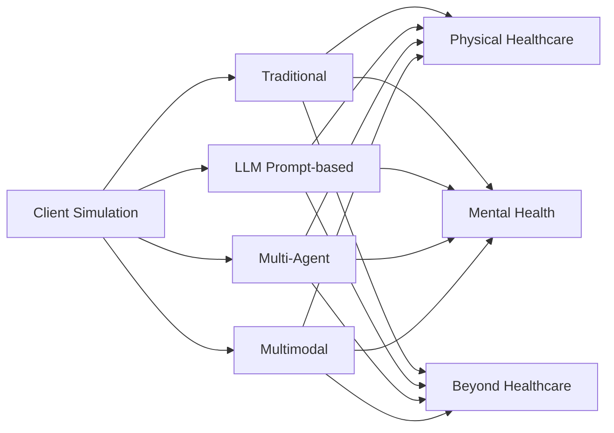

# A Survey of Client Simulation in Healthcare and Beyond

[](https://awesome.re) [](#) [](#)

You can Watch and Star this repository to follow updates for **A Survey of Client Simulation in Healthcare and Beyond**.

> Client simulation is about controllable, realistic, and domain-grounded interaction partners for training, evaluation, and synthetic data construction.

## Overview

This repository maintains the curated reading list for the paper:

**A Survey of Client Simulation in Healthcare and Beyond**

- Paper: coming soon



## Citation

Please update the author list and paper URL after publication.

```bibtex
@article{clientsimulation2026survey,
  title   = {A Survey of Client Simulation in Healthcare and Beyond},
  journal = {ACM Computing Surveys},
  year    = {2026},
  note    = {Manuscript in preparation}
}
```

## Welcome Contributions

If you find missing papers, datasets, benchmarks, or code repositories, please open an issue or pull request with the title, venue or year, paper link, code link if available, and the most relevant category below.

Last metadata and code verification: **2026-07-10**. Every entry was searched by its full paper title and cross-checked against the publisher page, official proceedings, DOI record, PubMed, arXiv, and GitHub. `Venue / Source` uses standard conference abbreviations or journal titles; entries labeled `arXiv` had no confirmed conference or journal version. Code links are included only when the repository is explicitly associated with the paper by the authors, paper, or official project page.

## Updates

- v0.1: Initial repository page, taxonomy, and curated resource index.

## Quick Links

- [1. Methodologies of Simulation](#1-methodologies-of-simulation)
  - [1.1 Traditional-based Client Simulation](#11-traditional-based-client-simulation)
  - [1.2 LLM Prompt-based Client Role-Playing](#12-llm-prompt-based-client-role-playing)
  - [1.3 Multi-Agent Client Simulation](#13-multi-agent-client-simulation)
  - [1.4 Multimodal Client Simulation](#14-multimodal-client-simulation)
- [2. Dataset, Benchmark, and Evaluation](#2-dataset-benchmark-and-evaluation)
  - [2.1 Dataset](#21-dataset)
  - [2.2 Benchmark](#22-benchmark)
  - [2.3 Evaluation Metrics](#23-evaluation-metrics)
- [3. Applications](#3-applications)
- [4. Challenges and Future Directions](#4-challenges-and-future-directions)

## 1. Methodologies of Simulation

### 1.1 Traditional-based Client Simulation

**Physical Healthcare Clients**

| :wrench: Method | :calendar: Year | :classical_building: Venue / Source | :memo: Description | :page_facing_up: Paper | :computer: Code |
|---|---:|---|---|---|---|
| Standardized Patient | 1968 | CMAJ | Human standardized-patient role play for medical teaching. | [Simulated patients in medical teaching](https://pubmed.ncbi.nlm.nih.gov/5646104/) | - |
| OSCE Assessment | 1975 | BMJ | Station-based assessment of clinical competence. | [Assessment of clinical competence using objective structured examination.](https://www.bmj.com/content/1/5955/447) | - |
| OSCE Standard Framework | 1979 | Medical Education | Objective structured clinical examination framework. | [Assessment of clinical competence using an objective structured clinical examination (OSCE).](https://doi.org/10.1111/j.1365-2923.1979.tb00918.x) | - |
| Harvey Cardiology Simulator | 1980 | American Journal of Cardiology | Physical cardiology patient simulator for bedside teaching. | [“Harvey,” the cardiology patient simulator: pilot studies on teaching effectiveness](https://doi.org/10.1016/0002-9149%2880%2990123-X) | - |
| SP Educational Framework | 1993 | Academic Medicine | Overview of standardized patients for teaching and evaluation. | [An overview of the uses of standardized patients for teaching and evaluating clinical skills. AAMC](https://doi.org/10.1097/00001888-199306000-00002) | - |
| Trauma Team Simulation | 2002 | Journal of Trauma | Advanced human patient simulator for trauma resuscitation. | [Evaluation of Trauma Team Performance Using an Advanced Human Patient Simulator for Resuscitation Training](https://pubmed.ncbi.nlm.nih.gov/12045633/) | - |
| AMEE SP Guide | 2009 | Medical Teacher | Practice guide for simulated patients in medical education. | [The use of simulated patients in medical education: AMEE Guide No 42](https://pubmed.ncbi.nlm.nih.gov/19811162/) | - |
| Patient Safety Simulation | 2011 | CHEST | Simulation-centered view of patient-safety training. | [Simulation to Enhance Patient Safety: Why Aren't We There Yet?](https://www.sciencedirect.com/science/article/pii/S0012369211605205) | - |

**Mental Health Clients**

| :wrench: Method | :calendar: Year | :classical_building: Venue / Source | :memo: Description | :page_facing_up: Paper | :computer: Code |
|---|---:|---|---|---|---|
| Psychotherapy SP Training | 1998 | Academic Medicine | Standardized patients for psychotherapy teaching and learning. | [Using standardized patients to teach and learn psychotherapy](https://pubmed.ncbi.nlm.nih.gov/9643906/) | - |
| Emotional Realism SP | 2001 | Academic Medicine | Actor portrayal challenge for emotional realism. | [Conveying emotional realism: a challenge to using standardized patients](https://pubmed.ncbi.nlm.nih.gov/11242566/) | - |
| Virtual Patient Interview | 2008 | Studies in Health Technology and Informatics | Virtual human patient for structured clinical interview training. | [Objective structured clinical interview training using a virtual human patient](https://pubmed.ncbi.nlm.nih.gov/18391321/) | - |
| PTSD Virtual Patient | 2008 | LNCS | Virtual PTSD patient for interview and assessment practice. | [Evaluation of Justina: A Virtual Patient with PTSD](https://doi.org/10.1007/978-3-540-85483-8_40) | - |
| Psychiatric Teaching Simulation | 2012 | Advances in Psychiatric Treatment | Review and guidance for simulation in psychiatric teaching. | [Simulation in psychiatric teaching](https://doi.org/10.1192/apt.bp.110.008482) | - |
| Psychiatry SP Evaluation | 2018 | BMC Medical Education | Standardized patients for psychiatry clinical-skills learning. | [Standardized patients in psychiatry - the best way to learn clinical skills?](https://link.springer.com/article/10.1186/s12909-018-1184-4) | - |
| Psychiatry Simulation Meta-Analysis | 2020 | Medical Education | Systematic review and meta-analysis of psychiatry simulation. | [Simulation in psychiatry for medical doctors: a systematic review and meta-analysis](https://doi.org/10.1111/medu.14166) | - |

**Beyond Healthcare: General Role-Playing**

| :wrench: Method | :calendar: Year | :classical_building: Venue / Source | :memo: Description | :page_facing_up: Paper | :computer: Code |
|---|---:|---|---|---|---|
| ELIZA | 1966 | Communications of the ACM | Early rule-based natural-language psychotherapy-style dialogue system. | [ELIZA—a computer program for the study of natural language communication between man and machine](https://doi.org/10.1145/365153.365168) | - |
| Legal Client Interview | 1980 | ETS Research Report | Simulation exercise for legal client interviewing skills. | [Assessing clinical skills in legal education: Simulation exercises in client interviewing](https://www.ets.org/research/policy_research_reports/publications/report/1980/hvwp.html) | - |
| AutoTutor | 2005 | IEEE Transactions on Education | Mixed-initiative tutoring dialogue system. | [AutoTutor: An intelligent tutoring system with mixed-initiative dialogue](https://doi.org/10.1109/TE.2005.856149) | - |
| ALICE | 2007 | Book | AIML-based open-domain chatbot framework. | [The Anatomy of A.L.I.C.E.](https://link.springer.com/book/10.1007/978-1-4020-6710-5) | - |
| Online Simulated Client | 2022 | European Journal of Law and Technology | Online simulated-client interviews for legal education. | [Transitioning simulated client interviews from face-to-face to online: Still an entrustable professional activity?](https://ejlt.org/index.php/ejlt/article/view/899) | - |
| Business Negotiation Practice | 2023 | Heliyon | Role-play simulation for business negotiation practice. | [Using business negotiation simulation with China's English-major undergraduates for practice ability development](https://doi.org/10.1016/j.heliyon.2023.e16236) | - |

### 1.2 LLM Prompt-based Client Role-Playing

**Physical Healthcare Clients**

| :wrench: Method | :calendar: Year | :classical_building: Venue / Source | :memo: Description | :page_facing_up: Paper | :computer: Code |
|---|---:|---|---|---|---|
| LLM-Mini-CEX | 2023 | arXiv | Automatic evaluation for diagnostic conversations. | [LLM-Mini-CEX: Automatic Evaluation of Large Language Model for Diagnostic Conversation](https://arxiv.org/abs/2308.07635) | - |
| GPT-SP | 2024 | JMIR Medical Education | GPT-powered simulated patient for history taking. | [A Generative Pretrained Transformer (GPT)-Powered Chatbot as a Simulated Patient to Practice History Taking: Prospective, Mixed Methods Study](https://mededu.jmir.org/2024/1/e53961) | - |
| SP+Feedback | 2024 | JMIR Medical Education | Language-model simulated patient with automated feedback. | [A Language Model-Powered Simulated Patient With Automated Feedback for History Taking: Prospective Study](https://mededu.jmir.org/2024/1/e59213) | - |
| Patient-Zero | 2026 | arXiv | Synthetic patient agents scaled without real patient data. | [Patient-Zero: Scaling Synthetic Patient Agents to Real-World Distributions without Real Patient Data](https://arxiv.org/abs/2509.11078) | - |
| Challenging Patient Interactions | 2025 | arXiv | LLM patients for difficult medical communication training. | [Modeling Challenging Patient Interactions: LLMs for Medical Communication Training](https://arxiv.org/abs/2503.22250) | - |
| PAL | 2025 | CSCW | Cooperative patient simulator for palliative-care training. | [PAL: Designing Conversational Agents as Scalable, Cooperative Patient Simulators for Palliative-Care Training](https://doi.org/10.1145/3715070.3749250) | - |
| EasyMED | 2026 | ACL | Comparison between human and LLM standardized patients. | [Human or LLM as Standardized Patients? A Comparative Study in Medical Education](https://aclanthology.org/2026.acl-long.1243/) | - |

**Mental Health Clients**

| :wrench: Method | :calendar: Year | :classical_building: Venue / Source | :memo: Description | :page_facing_up: Paper | :computer: Code |
|---|---:|---|---|---|---|
| PATIENT-psi | 2024 | EMNLP | LLM therapy patients grounded in CBT-style patient models. | [PATIENT-ψ: Using Large Language Models to Simulate Patients for Training Mental Health Professionals](https://aclanthology.org/2024.emnlp-main.711/) | [Code](https://github.com/ruiyiw/patient-psi) |
| Roleplay-doh | 2024 | EMNLP | Expert-authored behavioral principles for LLM-simulated patients. | [Roleplay-doh: Enabling Domain-Experts to Create LLM-simulated Patients via Eliciting and Adhering to Principles](https://aclanthology.org/2024.emnlp-main.591/) | - |
| TalkDep | 2025 | CIKM | Clinically grounded depression personas for screening dialogues. | [TalkDep: Clinically Grounded LLM Personas for Conversation-Centric Depression Screening](https://doi.org/10.1145/3746252.3761617) | - |
| TRUST | 2026 | JAMIA | Trauma understanding and structured-assessment dialogue simulation. | [TRUST: An LLM-Based Dialogue System for Trauma Understanding and Structured Assessments](https://doi.org/10.1093/jamia/ocag050) | - |
| MindVoyager | 2025 | ACL | Client openness and metacognition modeling for therapist evaluation. | [Can You Share Your Story? Modeling Clients' Metacognition and Openness for LLM Therapist Evaluation](https://aclanthology.org/2025.findings-acl.1332/) | - |
| PSYCHE | 2025 | arXiv | Multifaceted psychiatric patient simulation framework. | [PSYCHE: A Multi-faceted Patient Simulation Framework for Evaluation of Psychiatric Assessment Conversational Agents](https://arxiv.org/abs/2501.01594) | - |
| PsyCLIENT | 2026 | arXiv | Client simulation via counseling trajectory modeling. | [PsyCLIENT: Client Simulation via Conversational Trajectory Modeling for Trainee Practice and Model Evaluation in Mental Health Counseling](https://arxiv.org/abs/2601.07312) | - |
| CARE-Bench | 2026 | AAAI | Expert-guided diverse client simulations for counseling evaluation. | [CARE-Bench: A Benchmark of Diverse Client Simulations Guided by Expert Principles for Evaluating LLMs in Psychological Counseling](https://ojs.aaai.org/index.php/AAAI/article/view/41287) | - |

**Beyond Healthcare: General Role-Playing**

| :wrench: Method | :calendar: Year | :classical_building: Venue / Source | :memo: Description | :page_facing_up: Paper | :computer: Code |
|---|---:|---|---|---|---|
| Character-LLM | 2023 | EMNLP | Trainable role-playing agent for character simulation. | [Character-LLM: A Trainable Agent for Role-Playing](https://aclanthology.org/2023.emnlp-main.814/) | [Code](https://github.com/choosewhatulike/trainable-agents) |
| RoleLLM | 2024 | ACL | Benchmarking and improving LLM role-playing ability. | [RoleLLM: Benchmarking, Eliciting, and Enhancing Role-Playing Abilities of Large Language Models](https://aclanthology.org/2024.findings-acl.878/) | [Code](https://github.com/InteractiveNLP-Team/RoleLLM-public) |
| InCharacter | 2024 | ACL | Personality-fidelity evaluation through psychological interviews. | [InCharacter: Evaluating Personality Fidelity in Role-Playing Agents through Psychological Interviews](https://aclanthology.org/2024.acl-long.102/) | [Code](https://github.com/Neph0s/InCharacter) |
| CharacterEval | 2024 | ACL | Chinese benchmark for role-playing conversational agents. | [CharacterEval: A Chinese Benchmark for Role-Playing Conversational Agent Evaluation](https://aclanthology.org/2024.acl-long.638/) | [Code](https://github.com/morecry/CharacterEval) |
| RoleAgent | 2024 | NeurIPS | Script-based construction and benchmarking of role-playing agents. | [RoleAgent: Building, Interacting, and Benchmarking High-quality Role-Playing Agents from Scripts](https://proceedings.neurips.cc/paper_files/paper/2024/hash/5875aca1ef70285a35940afbbce0f9fb-Abstract-Datasets_and_Benchmarks_Track.html) | - |
| ROLETHINK | 2025 | EMNLP | Inner-thought reasoning benchmark for role-playing agents. | [Guess What I am Thinking: A Benchmark for Inner Thought Reasoning of Role-Playing Language Agents](https://aclanthology.org/2025.findings-emnlp.819/) | - |

### 1.3 Multi-Agent Client Simulation

**Physical Healthcare Clients**

| :wrench: Method | :calendar: Year | :classical_building: Venue / Source | :memo: Description | :page_facing_up: Paper | :computer: Code |
|---|---:|---|---|---|---|
| SAPS | 2024 | arXiv | State-aware patient simulator for interactive LLM evaluation. | [Automatic Interactive Evaluation for Large Language Models with State Aware Patient Simulator](https://arxiv.org/abs/2403.08495) | [Code](https://github.com/BlueZeros/Automatic_Interactive_Evaluation) |
| Adaptive-VP | 2025 | ACL | Virtual patient that adapts to trainee dialogue behavior. | [Adaptive-VP: A Framework for LLM-Based Virtual Patients that Adapts to Trainees' Dialogue to Facilitate Nurse Communication Training](https://aclanthology.org/2025.findings-acl.118/) | - |
| EvoPatient | 2025 | ACL | Agent coevolution for standardized-patient simulation. | [LLMs Can Simulate Standardized Patients via Agent Coevolution](https://aclanthology.org/2025.acl-long.846/) | [Code](https://github.com/ZJUMAI/EvoPatient) |
| PatientSim | 2025 | NeurIPS | Persona-driven doctor-patient interaction simulator. | [PatientSim: A Persona-Driven Simulator for Realistic Doctor-Patient Interactions](https://papers.neurips.cc/paper_files/paper/2025/hash/24945e3bdc7b3f4b2e64b9979a16f38e-Abstract-Datasets_and_Benchmarks_Track.html) | - |
| Agent Hospital | 2025 | arXiv | Hospital simulacrum with evolvable medical agents. | [Agent Hospital: A Simulacrum of Hospital with Evolvable Medical Agents](https://arxiv.org/abs/2405.02957) | - |
| AI Hospital | 2025 | COLING | Multi-agent medical interaction simulator and benchmark. | [AI Hospital: Benchmarking Large Language Models in a Multi-agent Medical Interaction Simulator](https://aclanthology.org/2025.coling-main.680/) | [Code](https://github.com/LibertFan/AI_Hospital) |
| MedAgentSim | 2025 | MICCAI | Self-evolving multi-agent clinical interaction simulation. | [MedAgentSim: Self-evolving Multi-agent Simulations for Realistic Clinical Interactions](https://papers.miccai.org/miccai-2025/0537-Paper2575.html) | [Code](https://github.com/MAXNORM8650/MedAgentSim) |
| AutoMedic | 2025 | arXiv | Dataset-grounded automated clinical-conversation evaluation. | [AutoMedic: An Automated Evaluation Framework for Clinical Conversational Agents with Medical Dataset Grounding](https://arxiv.org/abs/2512.10195) | - |
| DynamiCare | 2025 | arXiv | Dynamic multi-agent medical decision-making simulation. | [DynamiCare: A Dynamic Multi-Agent Framework for Interactive and Open-Ended Medical Decision-Making](https://arxiv.org/abs/2507.02616) | - |

**Mental Health Clients**

| :wrench: Method | :calendar: Year | :classical_building: Venue / Source | :memo: Description | :page_facing_up: Paper | :computer: Code |
|---|---:|---|---|---|---|
| EmoAgent | 2025 | EMNLP | Mental-health safety assessment and safeguard agents. | [EmoAgent: Assessing and Safeguarding Human-AI Interaction for Mental Health Safety](https://aclanthology.org/2025.emnlp-main.594/) | [Code](https://github.com/1akaman/EmoAgent) |
| AnnaAgent | 2025 | ACL | Dynamic seeker simulation with multi-session memory. | [AnnaAgent: Dynamic Evolution Agent System with Multi-Session Memory for Realistic Seeker Simulation](https://aclanthology.org/2025.findings-acl.1192/) | [Code](https://github.com/sci-m-wang/AnnaAgent) |
| MIND | 2025 | EMNLP | Multi-agent inner dialogue for psychological healing. | [MIND: Towards Immersive Psychological Healing with Multi-Agent Inner Dialogue](https://aclanthology.org/2025.findings-emnlp.499/) | - |
| DSM5AgentFlow | 2025 | CIKM | Multi-agent workflow for counseling and explainable diagnosis. | [Trustworthy AI Psychotherapy: Multi-Agent LLM Workflow for Counseling and Explainable Mental Disorder Diagnosis](https://doi.org/10.1145/3746252.3761164) | - |
| SynthAgent | 2026 | arXiv | Multi-agent patient simulation with obesity and mental-health comorbidity. | [SynthAgent: A Multi-Agent LLM Framework for Realistic Patient Simulation--A Case Study in Obesity with Mental Health Comorbidities](https://arxiv.org/abs/2602.08254) | - |
| Honesty-Aware Framework | 2026 | arXiv | Honesty-aware psychiatric intake data generation. | [Honesty-Aware Multi-Agent Framework for High-Fidelity Synthetic Data Generation in Digital Psychiatric Intake Doctor-Patient Interactions](https://arxiv.org/abs/2601.09216) | - |

**Beyond Healthcare: General Role-Playing**

| :wrench: Method | :calendar: Year | :classical_building: Venue / Source | :memo: Description | :page_facing_up: Paper | :computer: Code |
|---|---:|---|---|---|---|
| Generative Agents | 2023 | UIST | Believable human-behavior simulation with memory and planning. | [Generative Agents: Interactive Simulacra of Human Behavior](https://doi.org/10.1145/3586183.3606763) | [Code](https://github.com/joonspk-research/generative_agents) |
| CAMEL | 2023 | NeurIPS | Role-assigned communicative agents for society simulation. | [CAMEL: Communicative Agents for "Mind" Exploration of Large Language Model Society](https://proceedings.neurips.cc/paper/2023/hash/a3621ee907def47c1b952ade25c67698-Abstract-Conference.html) | [Code](https://github.com/camel-ai/camel) |
| IBSEN | 2024 | ACL | Director-actor collaboration for interactive drama scripts. | [IBSEN: Director-actor agent collaboration for controllable and interactive drama script generation](https://aclanthology.org/2024.acl-long.88/) | [Code](https://github.com/OpenDFM/ibsen) |
| SOTOPIA | 2024 | ICLR | Interactive environment for social intelligence evaluation. | [SOTOPIA: Interactive Evaluation for Social Intelligence in Language Agents](https://proceedings.iclr.cc/paper_files/paper/2024/file/b3075b88e583a0e98d8b24338a613060-Paper-Conference.pdf) | [Code](https://github.com/sotopia-lab/sotopia) |
| SOTOPIA-pi | 2024 | ACL | Interactive learning of socially intelligent language agents. | [SOTOPIA-π: Interactive Learning of Socially Intelligent Language Agents](https://aclanthology.org/2024.acl-long.698/) | [Code](https://github.com/sotopia-lab/sotopia) |
| SocialBench | 2024 | ACL | Individual and group sociality evaluation for role-playing agents. | [SocialBench: Sociality Evaluation of Role-Playing Conversational Agents](https://aclanthology.org/2024.findings-acl.125/) | [Code](https://github.com/X-PLUG/SocialBench) |
| MIRAGE | 2025 | ACL | Complex social interactive environments for LLM role-play. | [MIRAGE: Exploring How Large Language Models Perform in Complex Social Interactive Environments](https://aclanthology.org/2025.acl-short.2/) | [Code](https://github.com/lime728/MIRAGE) |
| CharacterBox | 2025 | NAACL | Virtual-world sandbox for role-playing trajectories. | [CharacterBox: Evaluating the Role-Playing Capabilities of LLMs in Text-Based Virtual Worlds](https://aclanthology.org/2025.naacl-long.323/) | [Code](https://github.com/Paitesanshi/CharacterBox) |
| Multi-Agent Character Simulation | 2025 | In2Writing | Multi-agent story-writing character simulation. | [Multi-Agent Based Character Simulation for Story Writing](https://aclanthology.org/2025.in2writing-1.9/) | - |

### 1.4 Multimodal Client Simulation

**Physical Healthcare Clients**

| :wrench: Method | :calendar: Year | :classical_building: Venue / Source | :memo: Description | :page_facing_up: Paper | :computer: Code |
|---|---:|---|---|---|---|
| Virtual Human Simulation | 2019 | JMIR | Virtual human simulation for clinical communication skills. | [Medical students' experiences and outcomes using a virtual human simulation to improve communication skills: mixed methods study](https://www.jmir.org/2019/11/e15459/) | - |
| Med-PMC | 2024 | arXiv | Personalized multimodal consultation with ask-first workflow. | [Med-PMC: Medical Personalized Multi-modal Consultation with a Proactive Ask-First-Observe-Next Paradigm](https://arxiv.org/abs/2408.08693) | - |
| Robot-LLM Virtual Patient | 2024 | HRI | Robot and LLM virtual patient for medical-student training. | [Creating Virtual Patients using Robots and Large Language Models: A Preliminary Study with Medical Students](https://doi.org/10.1145/3610978.3640592) | - |
| AgentClinic | 2025 | arXiv | Multimodal clinical agent benchmark. | [AgentClinic: a multimodal agent benchmark to evaluate AI in simulated clinical environments](https://arxiv.org/abs/2405.07960) | [Code](https://github.com/SamuelSchmidgall/AgentClinic) |
| 3MDBench | 2025 | EMNLP | Medical multimodal multi-agent dialogue benchmark. | [3MDBench: Medical Multimodal Multi-agent Dialogue Benchmark](https://aclanthology.org/2025.emnlp-main.1353/) | [Code](https://github.com/univanxx/3mdbench) |
| VR Clinical Simulation System | 2025 | CHI | VR clinical communication simulation with embodied agents. | [Designing VR simulation system for clinical communication training with LLMs-based embodied conversational agents](https://doi.org/10.1145/3706599.3719693) | - |
| CLiVR | 2025 | arXiv | VR conversational learning with AI-powered patients. | [CLiVR: Conversational Learning System in Virtual Reality with AI-Powered Patients](https://arxiv.org/abs/2510.19031) | - |
| LLM-Powered VP | 2025 | arXiv | Interactive virtual patient with automated feedback. | [LLM-Powered Virtual Patient Agents for Interactive Clinical Skills Training with Automated Feedback](https://arxiv.org/abs/2508.13943) | - |
| AI Standardized Patient | 2025 | arXiv | AI standardized patient for advanced cancer-care conversation. | [AI Standardized Patient Improves Human Conversations in Advanced Cancer Care](https://arxiv.org/abs/2505.02694) | - |
| AIMS | 2026 | arXiv | AI-enhanced immersive multidisciplinary simulation. | [Designing and Evaluating an AI-enhanced Immersive Multidisciplinary Simulation (AIMS) for Interprofessional Education](https://arxiv.org/abs/2510.08891) | - |

**Mental Health Clients**

| :wrench: Method | :calendar: Year | :classical_building: Venue / Source | :memo: Description | :page_facing_up: Paper | :computer: Code |
|---|---:|---|---|---|---|
| Psychiatric VP Evaluation | 2020 | Journal of Affective Disorders | Virtual agent for psychiatric interview training. | [Evaluation of a virtual agent to train medical students conducting psychiatric interviews for diagnosing major depressive disorders](https://doi.org/10.1016/j.jad.2019.11.117) | - |
| Psychiatric VP Design Guidelines | 2020 | Journal on Multimodal User Interfaces | Design guidelines for psychiatric virtual patients. | [Guidelines for the design of a virtual patient for psychiatric interview training](https://doi.org/10.1007/s12193-020-00338-8) | - |
| Embodied Virtual Patient | 2022 | Frontiers in Virtual Reality | Embodied virtual patients for psychiatric and geriatric care training. | [Embodied Virtual Patients as a Simulation-Based Framework for Training Clinician-Patient Communication Skills: An Overview of Their Use in Psychiatric and Geriatric Care](https://www.frontiersin.org/articles/10.3389/frvir.2022.827312) | - |
| Emotionally Responsive VP | 2024 | Simulation in Healthcare | Emotion-adaptive virtual patient simulation. | [Designing and Evaluating an Emotionally Responsive Virtual Patient Simulation](https://pubmed.ncbi.nlm.nih.gov/37651599/) | - |
| AVATAR Therapy | 2024 | Nature Medicine | Digital avatar therapy for psychosis-related distressing voices. | [Digital AVATAR therapy for distressing voices in psychosis: the phase 2/3 AVATAR2 trial](https://www.nature.com/articles/s41591-024-03252-8) | - |
| MIRROR | 2025 | EMNLP | Multimodal cognitive reframing under resistance. | [MIRROR: Multimodal Cognitive Reframing Therapy for Rolling with Resistance](https://aclanthology.org/2025.emnlp-main.751/) | - |
| Voice-Enabled VP System | 2025 | arXiv | Voice-based virtual patient for standardized clinical assessment. | [A Voice-Enabled Virtual Patient System for Interactive Training in Standardized Clinical Assessment](https://arxiv.org/abs/2511.00709) | - |
| M2CoSC | 2025 | NAACL | Multimodal cognitive reframing via psychotherapeutic reasoning. | [Multimodal Cognitive Reframing Therapy via Multi-hop Psychotherapeutic Reasoning](https://aclanthology.org/2025.naacl-long.250/) | - |
| Psychiatric Virtual SP System | 2026 | BMC Psychiatry | Virtual standardized psychiatric patient system. | [Development and preliminary evaluation of a virtual standardized patient system for psychiatric interview training](https://link.springer.com/article/10.1186/s12888-026-07896-3) | - |

**Beyond Healthcare: General Role-Playing**

| :wrench: Method | :calendar: Year | :classical_building: Venue / Source | :memo: Description | :page_facing_up: Paper | :computer: Code |
|---|---:|---|---|---|---|
| NarrativePlay | 2024 | EACL | Interactive narrative understanding and role-play. | [NarrativePlay: Interactive Narrative Understanding](https://aclanthology.org/2024.eacl-demo.10/) | - |
| MMRole | 2025 | ICLR | Framework for multimodal role-playing agents. | [MMRole: A Comprehensive Framework for Developing and Evaluating Multimodal Role-Playing Agents](https://proceedings.iclr.cc/paper_files/paper/2025/hash/a5c7206fd66e8314bb21a04492359353-Abstract-Conference.html) | [Code](https://github.com/YanqiDai/MMRole) |
| Video2Roleplay | 2025 | EMNLP | Video-guided role-playing dataset and framework. | [Video2Roleplay: A Multimodal Dataset and Framework for Video-Guided Role-playing Agents](https://aclanthology.org/2025.emnlp-main.1209/) | - |
| OmniCharacter | 2025 | ACL | Speech-language personality interaction for immersive role-play. | [OmniCharacter: Towards Immersive Role-Playing Agents with Seamless Speech-Language Personality Interaction](https://aclanthology.org/2025.acl-long.1276/) | [Code](https://github.com/AlibabaResearch/DAMO-ConvAI/tree/main/OmniCharacter) |
| GenECA | 2025 | INTERSPEECH | Real-time adaptive embodied conversational agents. | [GenECA: A General-Purpose Framework for Real-Time Adaptive Multimodal Embodied Conversational Agents](https://www.isca-archive.org/interspeech_2025/patapati25_interspeech.html) | - |
| UniCharacter | 2026 | arXiv | Customized multimodal role-play. | [Towards Customized Multimodal Role-Play](https://arxiv.org/abs/2605.08129) | - |
| Social VR ECA | 2026 | CHI | Embodied conversational agent for social VR language practice. | [LLM-based Embodied Conversational Agent for Reducing Foreign Language Speaking Anxiety in Social VR](https://doi.org/10.1145/3772318.3791068) | - |

## 2. Dataset, Benchmark, and Evaluation

### 2.1 Dataset

**Narrative-based Role Extraction**

| :wrench: Method | :calendar: Year | :classical_building: Venue / Source | :memo: Description | :page_facing_up: Paper | :computer: Code |
|---|---:|---|---|---|---|
| RoleLLM | 2024 | ACL | Role profiles and role-conditioned instruction data. | [RoleLLM: Benchmarking, Eliciting, and Enhancing Role-Playing Abilities of Large Language Models](https://aclanthology.org/2024.findings-acl.878/) | [Code](https://github.com/InteractiveNLP-Team/RoleLLM-public) |
| CharacterEval | 2024 | ACL | Chinese character attributes and dialogue evaluation data. | [CharacterEval: A Chinese Benchmark for Role-Playing Conversational Agent Evaluation](https://aclanthology.org/2024.acl-long.638/) | [Code](https://github.com/morecry/CharacterEval) |
| CoSER | 2025 | ICML | Established-role persona simulation dataset and models. | [CoSER: Coordinating LLM-Based Persona Simulation of Established Roles](https://proceedings.mlr.press/v267/wang25dk.html) | [Code](https://github.com/Neph0s/CoSER) |
| TwinVoice | 2026 | ACL | Digital-twin persona simulation benchmark. | [TwinVoice: A Multi-dimensional Benchmark Towards Digital Twins via LLM Persona Simulation](https://aclanthology.org/2026.findings-acl.981/) | - |
| RMTBench | 2025 | EMNLP | Multi-turn user-centric role-playing benchmark. | [RMTBench: Benchmarking LLMs Through Multi-Turn User-Centric Role-Playing](https://aclanthology.org/2025.findings-emnlp.730/) | - |
| SocialBench | 2024 | ACL | Social-context role-playing evaluation data. | [SocialBench: Sociality Evaluation of Role-Playing Conversational Agents](https://aclanthology.org/2024.findings-acl.125/) | [Code](https://github.com/X-PLUG/SocialBench) |

**Professional-case Transformation**

| :wrench: Method | :calendar: Year | :classical_building: Venue / Source | :memo: Description | :page_facing_up: Paper | :computer: Code |
|---|---:|---|---|---|---|
| AI Hospital / MVME | 2025 | COLING | Medical records transformed into multi-agent diagnosis cases. | [AI Hospital: Benchmarking Large Language Models in a Multi-agent Medical Interaction Simulator](https://aclanthology.org/2025.coling-main.680/) | [Code](https://github.com/LibertFan/AI_Hospital) |
| PatientSim | 2025 | NeurIPS | MIMIC-grounded patient profiles for history taking. | [PatientSim: A Persona-Driven Simulator for Realistic Doctor-Patient Interactions](https://papers.neurips.cc/paper_files/paper/2025/hash/24945e3bdc7b3f4b2e64b9979a16f38e-Abstract-Datasets_and_Benchmarks_Track.html) | - |
| GPT-SP | 2024 | JMIR Medical Education | Structured history-taking case with simulated-patient Q&A. | [A Generative Pretrained Transformer (GPT)-Powered Chatbot as a Simulated Patient to Practice History Taking: Prospective, Mixed Methods Study](https://mededu.jmir.org/2024/1/e53961) | - |
| SP+Feedback | 2024 | JMIR Medical Education | Simulated-patient dialogues with automated feedback. | [A Language Model-Powered Simulated Patient With Automated Feedback for History Taking: Prospective Study](https://mededu.jmir.org/2024/1/e59213) | - |
| Structured-Feedback SP | 2024 | BMC Medical Education | Patient simulation with structured feedback for students. | [Large Language Models Improve Clinical Decision Making of Medical Students Through Patient Simulation and Structured Feedback: A Randomized Controlled Trial](https://link.springer.com/article/10.1186/s12909-024-06399-7) | - |
| CommSkills-SP | 2025 | JMIR Medical Education | Patient simulation for communication-skills training. | [Large Language Model-Based Patient Simulation to Foster Communication Skills in Health Care Professionals: User-Centered Development and Usability Study](https://mededu.jmir.org/2025/1/e81271) | - |
| Multimetric SP | 2025 | JMIR | Multimetric standardized-patient training evaluation. | [Application of Large Language Models in Medical Training Evaluation---Using ChatGPT as a Standardized Patient: Multimetric Assessment](https://www.jmir.org/2025/1/e59435) | - |
| CureFun | 2024 | arXiv | Clinical education with LLM-simulated patients. | [Leveraging Large Language Model as Simulated Patients for Clinical Education](https://arxiv.org/abs/2404.13066) | - |

**Psychological-state Structuring**

| :wrench: Method | :calendar: Year | :classical_building: Venue / Source | :memo: Description | :page_facing_up: Paper | :computer: Code |
|---|---:|---|---|---|---|
| PATIENT-psi | 2024 | EMNLP | CBT-style cognitive models for simulated therapy patients. | [PATIENT-ψ: Using Large Language Models to Simulate Patients for Training Mental Health Professionals](https://aclanthology.org/2024.emnlp-main.711/) | [Code](https://github.com/ruiyiw/patient-psi) |
| MindVoyager | 2025 | ACL | Client metacognition and openness profiles. | [Can You Share Your Story? Modeling Clients' Metacognition and Openness for LLM Therapist Evaluation](https://aclanthology.org/2025.findings-acl.1332/) | - |
| PsyCLIENT | 2026 | arXiv | Counseling client profiles and trajectories. | [PsyCLIENT: Client Simulation via Conversational Trajectory Modeling for Trainee Practice and Model Evaluation in Mental Health Counseling](https://arxiv.org/abs/2601.07312) | - |
| CARE-Bench | 2026 | AAAI | Expert-guided diverse counseling client profiles. | [CARE-Bench: A Benchmark of Diverse Client Simulations Guided by Expert Principles for Evaluating LLMs in Psychological Counseling](https://ojs.aaai.org/index.php/AAAI/article/view/41287) | - |
| PSYCHE | 2025 | arXiv | Multifaceted psychiatric patient profiles. | [PSYCHE: A Multi-faceted Patient Simulation Framework for Evaluation of Psychiatric Assessment Conversational Agents](https://arxiv.org/abs/2501.01594) | - |

### 2.2 Benchmark

**Persona and Social Fidelity**

| :wrench: Method | :calendar: Year | :classical_building: Venue / Source | :memo: Description | :page_facing_up: Paper | :computer: Code |
|---|---:|---|---|---|---|
| RoleBench | 2024 | ACL | Role-conditioned QA and role-play evaluation. | [RoleLLM: Benchmarking, Eliciting, and Enhancing Role-Playing Abilities of Large Language Models](https://aclanthology.org/2024.findings-acl.878/) | [Code](https://github.com/InteractiveNLP-Team/RoleLLM-public) |
| CharacterEval | 2024 | ACL | Multidimensional role-playing evaluation. | [CharacterEval: A Chinese Benchmark for Role-Playing Conversational Agent Evaluation](https://aclanthology.org/2024.acl-long.638/) | [Code](https://github.com/morecry/CharacterEval) |
| InCharacter | 2024 | ACL | Psychometric personality-fidelity testing. | [InCharacter: Evaluating Personality Fidelity in Role-Playing Agents through Psychological Interviews](https://aclanthology.org/2024.acl-long.102/) | [Code](https://github.com/Neph0s/InCharacter) |
| ECHO | 2024 | arXiv | Indistinguishability and personal echo evaluation. | [How Well Can LLMs Echo Us? Evaluating AI Chatbots' Role-Play Ability with ECHO](https://arxiv.org/abs/2404.13957) | [Code](https://github.com/CUHK-ARISE/ECHO) |
| RoleAgentBench | 2024 | NeurIPS | Script-grounded role-agent benchmark. | [RoleAgent: Building, Interacting, and Benchmarking High-quality Role-Playing Agents from Scripts](https://proceedings.neurips.cc/paper_files/paper/2024/hash/5875aca1ef70285a35940afbbce0f9fb-Abstract-Datasets_and_Benchmarks_Track.html) | - |
| SocialBench | 2024 | ACL | Sociality evaluation across individual and group settings. | [SocialBench: Sociality Evaluation of Role-Playing Conversational Agents](https://aclanthology.org/2024.findings-acl.125/) | [Code](https://github.com/X-PLUG/SocialBench) |

**Clinical Workflows**

| :wrench: Method | :calendar: Year | :classical_building: Venue / Source | :memo: Description | :page_facing_up: Paper | :computer: Code |
|---|---:|---|---|---|---|
| AI Hospital / MVME | 2025 | COLING | Symptom, examination, and diagnosis workflow benchmark. | [AI Hospital: Benchmarking Large Language Models in a Multi-agent Medical Interaction Simulator](https://aclanthology.org/2025.coling-main.680/) | [Code](https://github.com/LibertFan/AI_Hospital) |
| PatientSim | 2025 | NeurIPS | Doctor-patient interaction consistency benchmark. | [PatientSim: A Persona-Driven Simulator for Realistic Doctor-Patient Interactions](https://papers.neurips.cc/paper_files/paper/2025/hash/24945e3bdc7b3f4b2e64b9979a16f38e-Abstract-Datasets_and_Benchmarks_Track.html) | - |
| CureFun | 2024 | arXiv | Checklist and automated scoring for clinical education. | [Leveraging Large Language Model as Simulated Patients for Clinical Education](https://arxiv.org/abs/2404.13066) | - |
| GPT-SP | 2024 | JMIR Medical Education | History-taking plausibility and usability evaluation. | [A Generative Pretrained Transformer (GPT)-Powered Chatbot as a Simulated Patient to Practice History Taking: Prospective, Mixed Methods Study](https://mededu.jmir.org/2024/1/e53961) | - |
| SP+Feedback | 2024 | JMIR Medical Education | Feedback quality and checklist agreement benchmark. | [A Language Model-Powered Simulated Patient With Automated Feedback for History Taking: Prospective Study](https://mededu.jmir.org/2024/1/e59213) | - |
| CommSkills-SP | 2025 | JMIR Medical Education | Communication-skills usability and physician-rating benchmark. | [Large Language Model-Based Patient Simulation to Foster Communication Skills in Health Care Professionals: User-Centered Development and Usability Study](https://mededu.jmir.org/2025/1/e81271) | - |

**Psychological Trajectory**

| :wrench: Method | :calendar: Year | :classical_building: Venue / Source | :memo: Description | :page_facing_up: Paper | :computer: Code |
|---|---:|---|---|---|---|
| ClientCAST | 2024 | arXiv | Client-centered assessment of LLM therapists. | [Towards a Client-Centered Assessment of LLM Therapists by Client Simulation](https://arxiv.org/abs/2406.12266) | [Code](https://github.com/wangjs9/ClientCAST) |
| Interactive Agents | 2024 | arXiv | Full counselor-client session simulation. | [Interactive Agents: Simulating Counselor-Client Psychological Counseling via Role-Playing LLM-to-LLM Interactions](https://arxiv.org/abs/2408.15787) | [Code](https://github.com/qiuhuachuan/interactive-agents) |
| PATIENT-psi | 2024 | EMNLP | Cognitive-model recovery through interaction. | [PATIENT-ψ: Using Large Language Models to Simulate Patients for Training Mental Health Professionals](https://aclanthology.org/2024.emnlp-main.711/) | [Code](https://github.com/ruiyiw/patient-psi) |
| MindVoyager | 2025 | ACL | Hidden-belief discovery under openness controls. | [Can You Share Your Story? Modeling Clients' Metacognition and Openness for LLM Therapist Evaluation](https://aclanthology.org/2025.findings-acl.1332/) | - |
| PSYCHE | 2025 | arXiv | Psychiatric profile recovery and expert review. | [PSYCHE: A Multi-faceted Patient Simulation Framework for Evaluation of Psychiatric Assessment Conversational Agents](https://arxiv.org/abs/2501.01594) | - |
| PsyCLIENT | 2026 | arXiv | Authenticity and confusion-rate evaluation. | [PsyCLIENT: Client Simulation via Conversational Trajectory Modeling for Trainee Practice and Model Evaluation in Mental Health Counseling](https://arxiv.org/abs/2601.07312) | - |
| CARE-Bench | 2026 | AAAI | Counseling quality and alliance-oriented evaluation. | [CARE-Bench: A Benchmark of Diverse Client Simulations Guided by Expert Principles for Evaluating LLMs in Psychological Counseling](https://ojs.aaai.org/index.php/AAAI/article/view/41287) | - |

### 2.3 Evaluation Metrics

- Reference-based evaluation: information recovery, symptom or attribute matching, checklist completion, profile recovery.
- Quality rating with scales and rubrics: naturalness, coherence, persona fidelity, clinical realism, therapeutic alliance, usability.
- Preference and indistinguishability testing: pairwise preference, human-likeness, role believability, simulated-vs-human discrimination.

## 3. Applications

- Educational applications: clinical interviewing, communication training, counseling practice, legal interviewing, negotiation, and service-oriented professional training.
- Synthetic data construction: controllable dialogue generation, rare scenario expansion, privacy-preserving counseling or clinical interaction data, and simulator-based model improvement.

## 4. Challenges and Future Directions

- Client simulation as evaluation: moving from static QA to interactive, scenario-based model assessment.
- Longitudinal state tracking: preserving memory, motivation, symptoms, trust, and emotional state across sessions.
- Calibrated non-cooperation: modeling vague disclosure, resistance, concealment, and partial information without arbitrary obstruction.
- Safety and ethics: governing vulnerable states, clinical risk scenarios, release boundaries, and downstream use.

## License

No repository-wide license has been added yet because the directory includes ACM template files and unpublished manuscript text. Add an explicit license after confirming publication and release policy.
