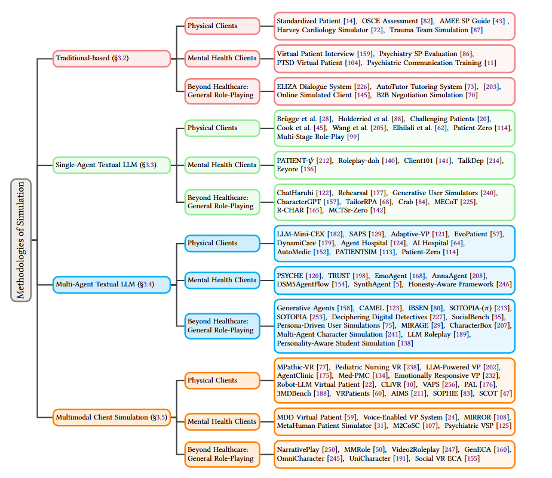

# A Survey of Client Simulation in Healthcare and Beyond

 

Curated resources for **A Survey of Client Simulation in Healthcare and Beyond**.

Last table-to-paper and code-link audit: **2026-09-05**.

Links: 📝 Paper · 💻 Code (shown when a repository link is available).

## Contents

- [Traditional-based client simulation](#1-traditional-based-client-simulation)
- [Single-agent textual LLM simulation](#2-single-agent-textual-llm-simulation)
- [Multi-agent textual LLM simulation](#3-multi-agent-textual-llm-simulation)
- [Multimodal client simulation](#4-multimodal-client-simulation)
- [Datasets, benchmarks, and evaluation protocols](#5-datasets-benchmarks-and-evaluation-protocols)

## 1. Traditional-based client simulation

**Physical Healthcare Clients**

| Method | Year | Venue / Source | Description & Links |
|---|---:|---|---|
| Standardized Patient (SP) | 1968 | CMAJ | Simulated patients in medical teaching [📝 Paper](https://pubmed.ncbi.nlm.nih.gov/5646104/ "Paper") |
| OSCE Assessment | 1975 | BMJ | Assessment of clinical competence using objective structured examination. [📝 Paper](https://www.bmj.com/content/1/5955/447 "Paper") |
| OSCE Standard Framework | 1979 | Medical Education | Assessment of clinical competence using an objective structured clinical examination (OSCE). [📝 Paper](https://doi.org/10.1111/j.1365-2923.1979.tb00918.x "Paper") |
| Harvey Cardiology Simulator | 1980 | American Journal of Cardiology | “Harvey,” the cardiology patient simulator: Pilot studies on teaching effectiveness [📝 Paper](https://doi.org/10.1016/0002-9149%2880%2990123-x "Paper") |
| SP Educational Framework | 1993 | Academic Medicine | An overview of the uses of standardized patients for teaching and evaluating clinical skills. AAMC [📝 Paper](https://doi.org/10.1097/00001888-199306000-00002 "Paper") |
| OR Crisis Simulation | 1995 | Journal of clinical anesthesia | Anesthesia crisis resource management: Real-life simulation training in operating room crises [📝 Paper](https://doi.org/10.1016/0952-8180%2895%2900146-8 "Paper") |
| Trauma Team Simulation | 2002 | Journal of Trauma | Evaluation of Trauma Team Performance Using an Advanced Human Patient Simulator for Resuscitation Training [📝 Paper](https://doi.org/10.1097/00005373-200206000-00009 "Paper") |
| Cardiac Arrest Team Simulation | 2008 | Chest | Simulation-Based Education Improves Quality of Care During Cardiac Arrest Team Responses at an Academic Teaching Hospital: A Case-Control Study [📝 Paper](https://doi.org/10.1016/s0734-3299%2808%2979117-2 "Paper") |
| CVC Mastery Learning | 2009 | Critical care medicine | Simulation-based mastery learning reduces complications during central venous catheter insertion in a medical intensive care unit* [📝 Paper](https://doi.org/10.1097/ccm.0b013e3181a57bc1 "Paper") |
| AMEE SP Guide | 2009 | Medical Teacher | The use of simulated patients in medical education: AMEE Guide No 42 [📝 Paper](https://doi.org/10.1080/01421590903002821 "Paper") |
| Procedural Skill Training | 2015 | BMC Medical Education | The benefit of repetitive skills training and frequency of expert feedback in the early acquisition of procedural skills [📝 Paper](https://doi.org/10.1186/s12909-015-0286-5 "Paper") |

**Mental Health Clients**

| Method | Year | Venue / Source | Description & Links |
|---|---:|---|---|
| Psychotherapy SP Training | 1998 | Academic Medicine | Using standardized patients to teach and learn psychotherapy [📝 Paper](https://doi.org/10.1097/00001888-199805000-00058 "Paper") |
| Affective SP Portrayal | 1999 | Teaching and Learning in Medicine | Effects of Portraying Psychologically and Emotionally Complex Standardized Patient Roles [📝 Paper](https://doi.org/10.1207/s15328015tl110303 "Paper") |
| Emotional Realism SP | 2001 | Academic medicine : journal of the Association of American Medical Colleges | Conveying Emotional Realism [📝 Paper](https://doi.org/10.1097/00001888-200103000-00003 "Paper") |
| Psychotherapy Feedback SP | 2002 | Academic Psychiatry | Using Standardized Patients for Formative Feedback in an Introduction to Psychotherapy Course [📝 Paper](https://doi.org/10.1176/appi.ap.26.3.168 "Paper") |
| Undergraduate Psychiatry SP | 2007 | Psychiatric Bulletin | Simulated patients in undergraduate education in psychiatry [📝 Paper](https://doi.org/10.1192/pb.bp.106.010793 "Paper") |
| Virtual Patient Interview | 2008 | Studies in Health Technology and Informatics | Objective structured clinical interview training using a virtual human patient [📝 Paper](https://pubmed.ncbi.nlm.nih.gov/18391321/ "Paper") |
| PTSD Virtual Patient | 2008 | LNCS | Evaluation of Justina: A Virtual Patient with PTSD [📝 Paper](https://doi.org/10.1007/978-3-540-85483-8_40 "Paper") |
| SP Anxiety Reduction | 2014 | Clinical Simulation in Nursing | Utilization of Standardized Patients to Decrease Nursing Student Anxiety [📝 Paper](https://doi.org/10.1016/j.ecns.2014.09.006 "Paper") |
| Psychiatric Simulation Engagement | 2017 | Academic Psychiatry | Simulation in Undergraduate Psychiatry: Exploring the Depth of Learner Engagement [📝 Paper](https://doi.org/10.1007/s40596-016-0633-9 "Paper") |
| Psychiatry SP Evaluation | 2018 | BMC Medical Education | Standardized patients in psychiatry – the best way to learn clinical skills? [📝 Paper](https://link.springer.com/article/10.1186/s12909-018-1184-4 "Paper") |
| Psychiatric Communication Training | 2020 | Frontiers in Psychiatry | Single-Day Simulation-Based Training Improves Communication and Psychiatric Skills of Medical Students [📝 Paper](https://doi.org/10.3389/fpsyt.2020.00221 "Paper") |

**Beyond Healthcare: General Role-Playing**

| Method | Year | Venue / Source | Description & Links |
|---|---:|---|---|
| ELIZA Dialogue System | 1966 | Communications of the ACM | ELIZA—a computer program for the study of natural language communication between man and machine [📝 Paper](https://doi.org/10.1145/365153.365168 "Paper") |
| Legal Client Interview | 1980 | ETS Research Report | ASSESSING CLINICAL SKILLS IN LEGAL EDUCATION: SIMULATION EXERCISES IN CLIENT INTERVIEWING [📝 Paper](https://doi.org/10.1002/j.2333-8504.1980.tb01233.x "Paper") |
| Bar Exam Standardized Client | 2004 | Ga. St. UL Rev. | Standardized clients: a possible improvement for the bar exam [📝 Paper](https://readingroom.law.gsu.edu/gsulr/vol20/iss4/9/ "Paper") |
| AutoTutor Tutoring System | 2005 | IEEE Transactions on Education | AutoTutor: An Intelligent Tutoring System With Mixed-Initiative Dialogue [📝 Paper](https://doi.org/10.1109/te.2005.856149 "Paper") |
| Legal Communication Assessment | 2006 | Clinical L. Rev. | Valuing what clients think: standardized clients and the assessment of communicative competence [📝 Paper](https://strathprints.strath.ac.uk/3212/ "Paper") |
| ALICE Chatbot Framework | 2007 | Parsing the Turing test: Philosophical and methodological issues in the quest for the thinking computer | The anatomy of ALICE [📝 Paper](https://doi.org/10.1007/978-1-4020-6710-5_13 "Paper") |
| Online Simulated Client | 2022 | European Journal of Law and Technology | Transitioning simulated client interviews from face-to-face to online: Still an entrustable professional activity? [📝 Paper](https://ejlt.org/index.php/ejlt/article/view/899 "Paper") |
| B2B Negotiation Simulation | 2022 | Industrial Marketing Management | Multiple parties behind and across the table: A role-play simulation of parallel, competitive order negotiations for training B2B sales professionals [📝 Paper](https://doi.org/10.1016/j.indmarman.2022.03.014 "Paper") |
| Business Negotiation Practice | 2023 | Heliyon | Using business negotiation simulation with China's English-major undergraduates for practice ability development [📝 Paper](https://doi.org/10.1016/j.heliyon.2023.e16236 "Paper") |

## 2. Single-agent textual LLM simulation

**Physical Healthcare Clients**

| Method | Year | Venue / Source | Description & Links |
|---|---:|---|---|
| Structured-Feedback SP | 2024 | BMC Medical Education | Large language models improve clinical decision making of medical students through patient simulation and structured feedback: a randomized controlled trial [📝 Paper](https://doi.org/10.1186/s12909-024-06399-7 "Paper") |
| SP+Feedback | 2024 | JMIR Medical Education | A Language Model–Powered Simulated Patient With Automated Feedback for History Taking: Prospective Study [📝 Paper](https://doi.org/10.2196/59213 "Paper") |
| Challenging Patients | 2025 | arXiv | Modeling Challenging Patient Interactions: LLMs for Medical Communication Training [📝 Paper](https://arxiv.org/abs/2503.22250 "Paper") |
| Virtual Patients | 2025 | J Med Internet Res | Virtual Patients Using Large Language Models: Scalable, Contextualized Simulation of Clinician-Patient Dialogue With Feedback [📝 Paper](https://doi.org/10.2196/68486 "Paper") |
| Multimetric SP | 2025 | JMIR | Application of Large Language Models in Medical Training Evaluation—Using ChatGPT as a Standardized Patient: Multimetric Assessment [📝 Paper](https://doi.org/10.2196/59435 "Paper") |
| CommSkills-SP | 2025 | JMIR Medical Education | Large Language Model–Based Patient Simulation to Foster Communication Skills in Health Care Professionals: User-Centered Development and Usability Study [📝 Paper](https://doi.org/10.2196/81271 "Paper") |
| Patient-Zero | 2026 | arXiv | Patient-Zero: Scaling Synthetic Patient Agents to Real-World Distributions without Real Patient Data [📝 Paper](https://arxiv.org/abs/2509.11078 "Paper") |
| Multi-Stage Role-Play | 2026 | ArXiv | Multi-Stage Patient Role-Playing Framework for Realistic Clinical Interactions [📝 Paper](https://arxiv.org/abs/2601.06373 "Paper") |
**Mental Health Clients**

| Method | Year | Venue / Source | Description & Links |
|---|---:|---|---|
| PATIENT-ψ | 2024 | EMNLP | PATIENT-𝜓: Using Large Language Models to Simulate Patients for Training Mental Health Professionals [📝 Paper](https://doi.org/10.18653/v1/2024.emnlp-main.711 "Paper") [💻 Code](https://github.com/ruiyiw/patient-psi "Code") |
| Roleplay-doh | 2024 | EMNLP | Roleplay-doh: Enabling Domain-Experts to Create LLM-simulated Patients via Eliciting and Adhering to Principles [📝 Paper](https://doi.org/10.18653/v1/2024.emnlp-main.591 "Paper") |
| Client101 | 2025 | JMIR Medical Education | Leveraging Large Language Models for Simulated Psychotherapy Client Interactions: Development and Usability Study of Client101 [📝 Paper](https://doi.org/10.2196/68056 "Paper") |
| TalkDep | 2025 | CIKM | TalkDep: Clinically Grounded LLM Personas for Conversation-Centric Depression Screening [📝 Paper](https://arxiv.org/abs/2508.04248 "Paper") |
| Eeyore | 2025 | Findings of the Association for Computational Linguistics: ACL 2025 | Eeyore: Realistic Depression Simulation via Expert-in-the-Loop Supervised and Preference Optimization [📝 Paper](https://doi.org/10.18653/v1/2025.findings-acl.707 "Paper") |
**Beyond Healthcare: General Role-Playing**

| Method | Year | Venue / Source | Description & Links |
|---|---:|---|---|
| ChatHaruhi | 2023 | arXiv preprint arXiv:2308.09597 | Chatharuhi: Reviving anime character in reality via large language model [📝 Paper](https://arxiv.org/abs/2308.09597 "Paper") |
| Rehearsal | 2024 | Proceedings of the 2024 CHI Conference on Human Factors in Computing Systems | Rehearsal: Simulating Conflict to Teach Conflict Resolution [📝 Paper](https://doi.org/10.1145/3613904.3642159 "Paper") |
| RoleAgent | 2024 | NeurIPS | RoleAgent: Building, Interacting, and Benchmarking High-quality Role-Playing Agents from Scripts [📝 Paper](https://doi.org/10.52202/079017-1563 "Paper") |
| Generative User Simulators | 2024 | Proceedings of the 2024 Conference of the North American Chapter of the Association for Computational Linguistics: Human Language Technologies (Volume 1: Long Papers) | Evaluating Large Language Models as Generative User Simulators for Conversational Recommendation [📝 Paper](https://doi.org/10.18653/v1/2024.naacl-long.83 "Paper") |
| CharacterGPT | 2025 | Proceedings of the 2025 Conference of the Nations of the Americas Chapter of the Association for Computational Linguistics: Human Language Technologies (Volume 3: Industry Track) | CharacterGPT: A Persona Reconstruction Framework for Role-Playing Agents [📝 Paper](https://doi.org/10.18653/v1/2025.naacl-industry.24 "Paper") [💻 Code](https://github.com/Jeiyoon/charactergpt "Code") |
| TailorRPA | 2025 | Findings of the Association for Computational Linguistics: EMNLP 2025 | TailorRPA: A Retrieval-Based Framework for Eliciting Personalized and Coherent Role-Playing Agents in General Domain [📝 Paper](https://doi.org/10.18653/v1/2025.findings-emnlp.288 "Paper") |
| Crab | 2025 | Proceedings of the 63rd Annual Meeting of the Association for Computational Linguistics (Volume 1: Long Papers) | Crab: A Novel Configurable Role-Playing LLM with Assessing Benchmark [📝 Paper](https://doi.org/10.18653/v1/2025.acl-long.731 "Paper") |
| MECoT | 2025 | Findings of the Association for Computational Linguistics: ACL 2025 | MECoT: Markov Emotional Chain-of-Thought for Personality-Consistent Role-Playing [📝 Paper](https://doi.org/10.18653/v1/2025.findings-acl.435 "Paper") |
| R-CHAR | 2025 | Proceedings of the 2025 Conference on Empirical Methods in Natural Language Processing | R-CHAR: A Metacognition-Driven Framework for Role-Playing in Large Language Models [📝 Paper](https://doi.org/10.18653/v1/2025.emnlp-main.1372 "Paper") |

## 3. Multi-agent textual LLM simulation

**Physical Healthcare Clients**

| Method | Year | Venue / Source | Description & Links |
|---|---:|---|---|
| LLM-Mini-CEX | 2023 | arXiv | LLM-Mini-CEX: Automatic Evaluation of Large Language Model for Diagnostic Conversation [📝 Paper](https://arxiv.org/abs/2308.07635 "Paper") |
| SAPS | 2024 | arXiv | Automatic Interactive Evaluation for Large Language Models with State Aware Patient Simulator [📝 Paper](https://arxiv.org/abs/2403.08495 "Paper") [💻 Code](https://github.com/BlueZeros/Automatic_Interactive_Evaluation "Code") |
| Adaptive-VP | 2025 | ACL | Adaptive-VP: A Framework for LLM-Based Virtual Patients that Adapts to Trainees’ Dialogue to Facilitate Nurse Communication Training [📝 Paper](https://doi.org/10.18653/v1/2025.findings-acl.118 "Paper") |
| EvoPatient | 2025 | ACL | LLMs Can Simulate Standardized Patients via Agent Coevolution [📝 Paper](https://doi.org/10.18653/v1/2025.acl-long.846 "Paper") [💻 Code](https://github.com/ZJUMAI/EvoPatient "Code") |
| PATIENTSIM | 2025 | NeurIPS | PatientSim: A Persona-Driven Simulator for Realistic Doctor-Patient Interactions [📝 Paper](https://arxiv.org/abs/2505.17818 "Paper") [💻 Code](https://github.com/dek924/PatientSim "Code") |
| Agent Hospital | 2025 | arXiv | Agent Hospital: A Simulacrum of Hospital with Evolvable Medical Agents [📝 Paper](https://arxiv.org/abs/2405.02957 "Paper") |
| AI Hospital | 2025 | COLING | AI Hospital: Benchmarking Large Language Models in a Multi-agent Medical Interaction Simulator [📝 Paper](https://aclanthology.org/2025.coling-main.680/ "Paper") [💻 Code](https://github.com/LibertFan/AI_Hospital "Code") |
| AutoMedic | 2025 | arXiv | AutoMedic: An Automated Evaluation Framework for Clinical Conversational Agents with Medical Dataset Grounding [📝 Paper](https://arxiv.org/abs/2512.10195 "Paper") |
| DynamiCare | 2025 | arXiv | DynamiCare: A Dynamic Multi-Agent Framework for Interactive and Open-Ended Medical Decision-Making [📝 Paper](https://arxiv.org/abs/2507.02616 "Paper") |
**Mental Health Clients**

| Method | Year | Venue / Source | Description & Links |
|---|---:|---|---|
| PSYCHE | 2025 | arXiv | PSYCHE: A Multi-faceted Patient Simulation Framework for Evaluation of Psychiatric Assessment Conversational Agents [📝 Paper](https://arxiv.org/abs/2501.01594 "Paper") |
| TRUST | 2025 | JAMIA | TRUST: An LLM-Based Dialogue System for Trauma Understanding and Structured Assessments [📝 Paper](https://arxiv.org/abs/2504.21851 "Paper") |
| EmoAgent | 2025 | EMNLP | EmoAgent: Assessing and Safeguarding Human-AI Interaction for Mental Health Safety [📝 Paper](https://doi.org/10.18653/v1/2025.emnlp-main.594 "Paper") [💻 Code](https://github.com/1akaman/EmoAgent "Code") |
| AnnaAgent | 2025 | ACL | AnnaAgent: Dynamic Evolution Agent System with Multi-Session Memory for Realistic Seeker Simulation [📝 Paper](https://doi.org/10.18653/v1/2025.findings-acl.1192 "Paper") [💻 Code](https://github.com/sci-m-wang/AnnaAgent "Code") |
| DSM5AgentFlow | 2025 | CIKM | Trustworthy AI Psychotherapy: Multi-Agent LLM Workflow for Counseling and Explainable Mental Disorder Diagnosis [📝 Paper](https://doi.org/10.1145/3746252.3761164 "Paper") |
| SynthAgent | 2026 | arXiv | SynthAgent: A Multi-Agent LLM Framework for Realistic Patient Simulation–A Case Study in Obesity with Mental Health Comorbidities [📝 Paper](https://arxiv.org/abs/2602.08254 "Paper") |
| Honesty-Aware Framework | 2026 | arXiv | Honesty-Aware Multi-Agent Framework for High-Fidelity Synthetic Data Generation in Digital Psychiatric Intake Doctor-Patient Interactions [📝 Paper](https://arxiv.org/abs/2601.09216 "Paper") |
**Beyond Healthcare: General Role-Playing**

| Method | Year | Venue / Source | Description & Links |
|---|---:|---|---|
| Generative Agents | 2023 | UIST | Generative Agents: Interactive Simulacra of Human Behavior [📝 Paper](https://doi.org/10.1145/3586183.3606763 "Paper") [💻 Code](https://github.com/joonspk-research/generative_agents "Code") |
| CAMEL | 2023 | NeurIPS | CAMEL: Communicative Agents for "Mind" Exploration of Large Language Model Society [📝 Paper](https://doi.org/10.52202/075280-2264 "Paper") [💻 Code](https://github.com/camel-ai/camel "Code") |
| IBSEN | 2024 | ACL | IBSEN: Director-Actor Agent Collaboration for Controllable and Interactive Drama Script Generation [📝 Paper](https://doi.org/10.18653/v1/2024.acl-long.88 "Paper") [💻 Code](https://github.com/OpenDFM/ibsen "Code") |
| SOTOPIA | 2024 | International Conference on Learning Representations | SOTOPIA: Interactive Evaluation for Social Intelligence in Language Agents [📝 Paper](https://proceedings.iclr.cc/paper_files/paper/2024/file/b3075b88e583a0e98d8b24338a613060-Paper-Conference.pdf "Paper") |
| SOTOPIA-π | 2024 | ACL | SOTOPIA-π: Interactive Learning of Socially Intelligent Language Agents [📝 Paper](https://doi.org/10.18653/v1/2024.acl-long.698 "Paper") [💻 Code](https://github.com/sotopia-lab/sotopia "Code") |
| Deciphering Digital Detectives | 2024 | Findings of the Association for Computational Linguistics: ACL 2024 | Deciphering Digital Detectives: Understanding LLM Behaviors and Capabilities in Multi-Agent Mystery Games [📝 Paper](https://doi.org/10.18653/v1/2024.findings-acl.490 "Paper") |
| SocialBench | 2024 | ACL | SocialBench: Sociality Evaluation of Role-Playing Conversational Agents [📝 Paper](https://doi.org/10.18653/v1/2024.findings-acl.125 "Paper") [💻 Code](https://github.com/X-PLUG/SocialBench "Code") |
| Personality-Aware Student Simulation | 2024 | Proceedings of the 2024 Conference on Empirical Methods in Natural Language Processing | Personality-aware Student Simulation for Conversational Intelligent Tutoring Systems [📝 Paper](https://doi.org/10.18653/v1/2024.emnlp-main.37 "Paper") |
| MIRAGE | 2025 | ACL | MIRAGE: Exploring How Large Language Models Perform in Complex Social Interactive Environments [📝 Paper](https://doi.org/10.18653/v1/2025.acl-short.2 "Paper") [💻 Code](https://github.com/lime728/MIRAGE "Code") |
| CharacterBox | 2025 | NAACL | CharacterBox: Evaluating the Role-Playing Capabilities of LLMs in Text-Based Virtual Worlds [📝 Paper](https://doi.org/10.18653/v1/2025.naacl-long.323 "Paper") [💻 Code](https://github.com/Paitesanshi/CharacterBox "Code") |
| Multi-Agent Character Simulation | 2025 | In2Writing | Multi-Agent Based Character Simulation for Story Writing [📝 Paper](https://doi.org/10.18653/v1/2025.in2writing-1.9 "Paper") |
| LLM Roleplay | 2025 | Proceedings of the Third Workshop on Social Influence in Conversations (SICon 2025) | LLM Roleplay: Simulating Human-Chatbot Interaction [📝 Paper](https://doi.org/10.18653/v1/2025.sicon-1.1 "Paper") |
| Persona-Driven User Simulations | 2025 | Proceedings of the 2025 Conference on Empirical Methods in Natural Language Processing: Industry Track | Evaluating Conversational Agents with Persona-driven User Simulations based on Large Language Models: A Sales Bot Case Study [📝 Paper](https://doi.org/10.18653/v1/2025.emnlp-industry.16 "Paper") |

## 4. Multimodal client simulation

**Physical Healthcare Clients**

| Method | Year | Venue / Source | Description & Links |
|---|---:|---|---|
| MPathic-VR | 2019 | JMIR | Medical Students’ Experiences and Outcomes Using a Virtual Human Simulation to Improve Communication Skills: Mixed Methods Study [📝 Paper](https://doi.org/10.2196/15459 "Paper") |
| Pediatric Nursing VR | 2024 | JMIR Medical Education | Multidisciplinary Design–Based Multimodal Virtual Reality Simulation in Nursing Education: Mixed Methods Study [📝 Paper](https://doi.org/10.2196/53106 "Paper") |
| Med-PMC | 2024 | arXiv | Med-PMC: Medical Personalized Multi-modal Consultation with a Proactive Ask-First-Observe-Next Paradigm [📝 Paper](https://arxiv.org/abs/2408.08693 "Paper") [💻 Code](https://github.com/LiuHC0428/Med-PMC "Code") |
| Robot-LLM Virtual Patient | 2024 | HRI | Creating Virtual Patients using Robots and Large Language Models: A Preliminary Study with Medical Students [📝 Paper](https://doi.org/10.1145/3610978.3640592 "Paper") |
| Emotionally Responsive VP | 2023 | Simulation in Healthcare | Designing and Evaluating an Emotionally Responsive Virtual Patient Simulation [📝 Paper](https://doi.org/10.1097/SIH.0000000000000730 "Paper") |
| AgentClinic | 2025 | arXiv | AgentClinic: a multimodal agent benchmark to evaluate AI in simulated clinical environments [📝 Paper](https://arxiv.org/abs/2405.07960 "Paper") [💻 Code](https://github.com/SamuelSchmidgall/AgentClinic "Code") |
| 3MDBench | 2025 | EMNLP | 3MDBench: Medical Multimodal Multi-agent Dialogue Benchmark [📝 Paper](https://doi.org/10.18653/v1/2025.emnlp-main.1353 "Paper") [💻 Code](https://github.com/univanxx/3mdbench "Code") |
| VAPS | 2025 | CHI | Designing VR Simulation System for Clinical Communication Training with LLMs-Based Embodied Conversational Agents [📝 Paper](https://doi.org/10.1145/3706599.3719693 "Paper") |
| CLiVR | 2025 | arXiv | CLiVR: Conversational Learning System in Virtual Reality with AI-Powered Patients [📝 Paper](https://arxiv.org/abs/2510.19031 "Paper") |
| LLM-Powered VP | 2025 | arXiv | LLM-Powered Virtual Patient Agents for Interactive Clinical Skills Training with Automated Feedback [📝 Paper](https://arxiv.org/abs/2508.13943 "Paper") |
| VRPatients | 2025 | BMC Medical Education | Virtual patient simulation to enhance medical students’ clinical communication and decision-making skills: a pilot study [📝 Paper](https://doi.org/10.1186/s12909-025-08507-7 "Paper") |
| SOPHIE | 2025 | arXiv | AI Standardized Patient Improves Human Conversations in Advanced Cancer Care [📝 Paper](https://arxiv.org/abs/2505.02694 "Paper") |
| PAL | 2025 | CSCW | PAL: Designing Conversational Agents as Scalable, Cooperative Patient Simulators for Palliative‑Care Training [📝 Paper](https://doi.org/10.1145/3715070.3749250 "Paper") |
| SCOT | 2025 | Advances in Simulation | Training communication skills in a multiuser medical virtual reality simulation: a qualitative, observational study [📝 Paper](https://doi.org/10.1186/s41077-025-00386-8 "Paper") |
| AIMS | 2026 | arXiv | Designing and Evaluating an AI-enhanced Immersive Multidisciplinary Simulation (AIMS) for Interprofessional Education [📝 Paper](https://arxiv.org/abs/2510.08891 "Paper") |
**Mental Health Clients**

| Method | Year | Venue / Source | Description & Links |
|---|---:|---|---|
| MDD Virtual Patient | 2019 | Journal of Affective Disorders | Evaluation of a virtual agent to train medical students conducting psychiatric interviews for diagnosing major depressive disorders [📝 Paper](https://doi.org/10.1016/j.jad.2019.11.117 "Paper") |
| MIRROR | 2025 | EMNLP | MIRROR: Multimodal Cognitive Reframing Therapy for Rolling with Resistance [📝 Paper](https://doi.org/10.18653/v1/2025.emnlp-main.751 "Paper") |
| Voice-Enabled VP System | 2025 | arXiv | A Voice-Enabled Virtual Patient System for Interactive Training in Standardized Clinical Assessment [📝 Paper](https://arxiv.org/abs/2511.00709 "Paper") |
| MetaHuman Patient Simulator | 2025 | arXiv.org | Learning When to Ask: Simulation-Trained Humanoids for Mental-Health Diagnosis [📝 Paper](https://arxiv.org/abs/2512.08952 "Paper") |
| M2CoSC | 2025 | NAACL | Multimodal Cognitive Reframing Therapy via Multi-hop Psychotherapeutic Reasoning [📝 Paper](https://doi.org/10.18653/v1/2025.naacl-long.250 "Paper") |
| Psychiatric VSP | 2026 | BMC Psychiatry | Development and preliminary evaluation of a virtual standardized patient system for psychiatric interview training [📝 Paper](https://doi.org/10.1186/s12888-026-07896-3 "Paper") |
**Beyond Healthcare: General Role-Playing**

| Method | Year | Venue / Source | Description & Links |
|---|---:|---|---|
| NarrativePlay | 2024 | EACL | NarrativePlay: Interactive Narrative Understanding [📝 Paper](https://doi.org/10.18653/v1/2024.eacl-demo.10 "Paper") |
| MMRole | 2025 | ICLR | Mmrole: A comprehensive framework for developing and evaluating multimodal role-playing agents [📝 Paper](https://proceedings.iclr.cc/paper_files/paper/2025/hash/a5c7206fd66e8314bb21a04492359353-Abstract-Conference.html "Paper") [💻 Code](https://github.com/YanqiDai/MMRole "Code") |
| Video2Roleplay | 2025 | EMNLP | Video2Roleplay: A Multimodal Dataset and Framework for Video-Guided Role-playing Agents [📝 Paper](https://doi.org/10.18653/v1/2025.emnlp-main.1209 "Paper") |
| OmniCharacter | 2025 | ACL | OmniCharacter: Towards Immersive Role-Playing Agents with Seamless Speech-Language Personality Interaction [📝 Paper](https://doi.org/10.18653/v1/2025.acl-long.1276 "Paper") [💻 Code](https://github.com/AlibabaResearch/DAMO-ConvAI/tree/main/OmniCharacter "Code") |
| GenECA | 2025 | INTERSPEECH | GenECA: A General-Purpose Framework for Real-Time Adaptive Multimodal Embodied Conversational Agents [📝 Paper](https://www.isca-archive.org/interspeech_2025/patapati25_interspeech.html "Paper") |
| UniCharacter | 2026 | arXiv | Towards Customized Multimodal Role-Play [📝 Paper](https://arxiv.org/abs/2605.08129 "Paper") [💻 Code](https://github.com/Tangc03/UniCharacter "Code") |
| Social VR ECA | 2026 | CHI | LLM-based Embodied Conversational Agent for Reducing Foreign Language Speaking Anxiety in Social VR [📝 Paper](https://doi.org/10.1145/3772318.3791068 "Paper") |

## 5. Datasets, benchmarks, and evaluation protocols

| Resource | Year | Venue / Source | Description & Links |
|---|---:|---|---|
| RoleBench | 2023 | ACL | RoleLLM: Benchmarking, Eliciting, and Enhancing Role-Playing Abilities of Large Language Models [📝 Paper](https://doi.org/10.18653/v1/2024.findings-acl.878 "Paper") [💻 Code](https://github.com/InteractiveNLP-Team/RoleLLM-public "Code") |
| CharacterEval | 2024 | ACL | CharacterEval: A Chinese Benchmark for Role-Playing Conversational Agent Evaluation [📝 Paper](https://doi.org/10.18653/v1/2024.acl-long.638 "Paper") [💻 Code](https://github.com/morecry/CharacterEval "Code") |
| InCharacter | 2024 | ACL | InCharacter: Evaluating Personality Fidelity in Role-Playing Agents through Psychological Interviews [📝 Paper](https://doi.org/10.18653/v1/2024.acl-long.102 "Paper") [💻 Code](https://github.com/Neph0s/InCharacter "Code") |
| ECHO | 2024 | arXiv | How Well Can LLMs Echo Us? Evaluating AI Chatbots' Role-Play Ability with ECHO [📝 Paper](https://arxiv.org/abs/2404.13957 "Paper") [💻 Code](https://github.com/CUHK-ARISE/ECHO "Code") |
| RoleAgentBench | 2024 | NeurIPS | RoleAgent: Building, Interacting, and Benchmarking High-quality Role-Playing Agents from Scripts [📝 Paper](https://doi.org/10.52202/079017-1563 "Paper") |
| SocialBench | 2024 | ACL | SocialBench: Sociality Evaluation of Role-Playing Conversational Agents [📝 Paper](https://doi.org/10.18653/v1/2024.findings-acl.125 "Paper") [💻 Code](https://github.com/X-PLUG/SocialBench "Code") |
| GPT-SP | 2024 | JMIR Medical Education | A Generative Pretrained Transformer (GPT)–Powered Chatbot as a Simulated Patient to Practice History Taking: Prospective, Mixed Methods Study [📝 Paper](https://doi.org/10.2196/53961 "Paper") |
| SP+Feedback | 2024 | JMIR Medical Education | A Language Model–Powered Simulated Patient With Automated Feedback for History Taking: Prospective Study [📝 Paper](https://doi.org/10.2196/59213 "Paper") |
| Structured-Feedback SP | 2024 | BMC Medical Education | Large language models improve clinical decision making of medical students through patient simulation and structured feedback: a randomized controlled trial [📝 Paper](https://doi.org/10.1186/s12909-024-06399-7 "Paper") |
| CureFun | 2024 | arXiv | Leveraging Large Language Model as Simulated Patients for Clinical Education [📝 Paper](https://arxiv.org/abs/2404.13066 "Paper") |
| ClientCAST | 2024 | arXiv | Towards a Client-Centered Assessment of LLM Therapists by Client Simulation [📝 Paper](https://arxiv.org/abs/2406.12266 "Paper") [💻 Code](https://github.com/wangjs9/ClientCAST "Code") |
| Interactive Agents | 2024 | arXiv | Interactive Agents: Simulating Counselor-Client Psychological Counseling via Role-Playing LLM-to-LLM Interactions [📝 Paper](https://arxiv.org/abs/2408.15787 "Paper") [💻 Code](https://github.com/qiuhuachuan/interactive-agents "Code") |
| PATIENT-ψ | 2024 | EMNLP | PATIENT-𝜓: Using Large Language Models to Simulate Patients for Training Mental Health Professionals [📝 Paper](https://doi.org/10.18653/v1/2024.emnlp-main.711 "Paper") [💻 Code](https://github.com/ruiyiw/patient-psi "Code") |
| CoSER | 2025 | ICML | CoSER: Coordinating LLM-Based Persona Simulation of Established Roles [📝 Paper](https://proceedings.mlr.press/v267/wang25dk.html "Paper") [💻 Code](https://github.com/Neph0s/CoSER "Code") |
| TwinVoice | 2025 | ACL | TwinVoice: A Multi-dimensional Benchmark Towards Digital Twins via LLM Persona Simulation [📝 Paper](https://arxiv.org/abs/2510.25536 "Paper") |
| RMTBench | 2025 | EMNLP | RMTBench: Benchmarking LLMs Through Multi-Turn User-Centric Role-Playing [📝 Paper](https://arxiv.org/abs/2507.20352 "Paper") |
| AI Hospital/MVME | 2025 | COLING | AI Hospital: Benchmarking Large Language Models in a Multi-agent Medical Interaction Simulator [📝 Paper](https://aclanthology.org/2025.coling-main.680/ "Paper") [💻 Code](https://github.com/LibertFan/AI_Hospital "Code") |
| PatientSim | 2025 | NeurIPS | PatientSim: A Persona-Driven Simulator for Realistic Doctor-Patient Interactions [📝 Paper](https://arxiv.org/abs/2505.17818 "Paper") [💻 Code](https://github.com/dek924/PatientSim "Code") |
| CommSkills-SP | 2025 | JMIR Medical Education | Large Language Model–Based Patient Simulation to Foster Communication Skills in Health Care Professionals: User-Centered Development and Usability Study [📝 Paper](https://doi.org/10.2196/81271 "Paper") |
| Multimetric SP | 2025 | JMIR | Application of Large Language Models in Medical Training Evaluation—Using ChatGPT as a Standardized Patient: Multimetric Assessment [📝 Paper](https://doi.org/10.2196/59435 "Paper") |
| CARE-Bench | 2025 | AAAI | CARE-Bench: A Benchmark of Diverse Client Simulations Guided by Expert Principles for Evaluating LLMs in Psychological Counseling [📝 Paper](https://arxiv.org/abs/2511.09407 "Paper") |
| ROLETHINK | 2025 | EMNLP | Guess What I am Thinking: A Benchmark for Inner Thought Reasoning of Role-Playing Language Agents [📝 Paper](https://arxiv.org/abs/2503.08193 "Paper") [💻 Code](https://github.com/airaer1998/RPA_Thought "Code") |
| MindVoyager | 2025 | ACL | Can You Share Your Story? Modeling Clients’ Metacognition and Openness for LLM Therapist Evaluation [📝 Paper](https://doi.org/10.18653/v1/2025.findings-acl.1332 "Paper") |
| PSYCHE | 2025 | arXiv | PSYCHE: A Multi-faceted Patient Simulation Framework for Evaluation of Psychiatric Assessment Conversational Agents [📝 Paper](https://arxiv.org/abs/2501.01594 "Paper") |
| PsyCLIENT | 2026 | arXiv | PsyCLIENT: Client Simulation via Conversational Trajectory Modeling for Trainee Practice and Model Evaluation in Mental Health Counseling [📝 Paper](https://arxiv.org/abs/2601.07312 "Paper") |

## 💡 欢迎为 A Survey of Client Simulation in Healthcare and Beyond 贡献 💡

如果你发现缺失的工作或有建议，欢迎发起 Issue 或通过 **[xxx@mail.huft.edu.cn](mailto:xxx@mail.huft.edu.cn)** 联系我们。我们会及时更新仓库。
